## 实现北极熊奔跑动画

CSS3动画中应用的定时函数（timing function）常用的有内置关键字`linear, ease, ease-in, ease-out, ease-in-out, step-start, step-end`，另外还有两个内置的缓动函数`cubic-bezier(), steps()`

其中`steps()`这个函数是将整个动画过程分为指定的步数（在动画过程中插值，显示指定位置的快照），并在一个动画循环的时间内按照一定规则走完划分的步数。常用的场景是将多个动画帧组合成连续的动态效果，如下：

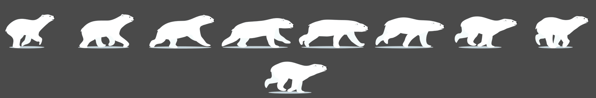

这个动画的主要代码如下：

```html
<div class="running-bear"></div>
```

```css
.running-bear {
    width: 200px;
    height: 100px;
    background: url(./bear.png) 0 / cover no-repeat;
    animation: run 1s steps(8) 0s infinite;
}

@keyframes run {
    to {
        /* 背景图片宽度为 1600px */
        background-position: -1600px;
    }
}
```

如果细心观察会发现，一个动画循环结束时，这个动画使用的背景图片是不在可视区域内的，因为背景图片最终的偏移量和宽度相等，图片被移出了框体。

为了方便展示背景图片（`.running-bear`）被移动时和框体（`.box`）的相对偏移量，不使用背景图片偏移，而是直接偏移含有背景图片的框体，现将主要代码改写如下：
```html
<div class="box">
    <div class="running-bear"></div>
</div>
```

```css
.box {
    width: 100px;
    height: 50px;
    border: 5px solid red;
}

.running-bear {
    width: 800px;
    height: 50px;
    background: url(./bear.png) 0 / cover no-repeat;
    /* 只循环一次，一秒一个动画帧，并且在动画结束时保留动画结束状态 */
    animation: run 8s steps(8) 0s 1 forwards;
}

@keyframes run {
    to {
        /* 此时背景图片宽度为 800px ，100% 表示宽度的 100% */
        transform: translate(-100%);
    }
}
```

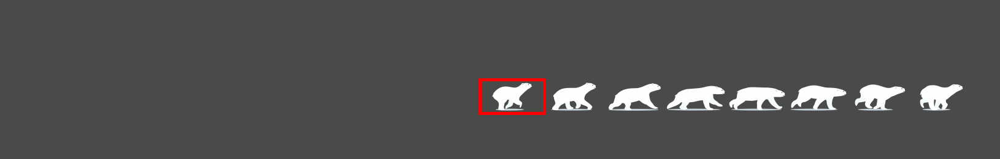

现在可以清晰的看到在一个循环结束时，图片实际上是不在框体内的。那为什么整个动画过程中并没有察觉到图片消失空白的瞬间呢？这涉及到了`steps()`的第二个参数起到的作用。

## 为什么最后的空白察觉不到

`steps()`可以取两个参数，一个是步数，一个是采用的步进规则，默认的步进规则是`end`/`jump-end`，在读下文以前，只要知道**这个`end`/`jump-end`会使得动画在每两步之间发生的时间间隔结束时才会从当前动画状态跳到下一个动画状态**就可以了。

在每个动画状态显示的时间间隔结束时的那一刻才会跳到下一动画状态，这就导致了**一个动画循环里的最后状态，根本没有余留的时间间隔让它停留在我们的视野中**（上述是因为特地设置了`forwards`才保留了最终状态）。而当动画无限循环时（`infinite`），动画的每个循环是一个紧接着一个的，上一个循环结束的时间点就是下一循环开始的时间点，所以一个循环结束后，下一循环的第一帧画面（起始状态）立马就会展示，一个动画的最终状态压根不会有机会被展示，这就是察觉不到那个空白的瞬间的原因。

### 对这个问题不了解导致的常见误区

很多人往往会犯一个错误就是：既然这个动画有8帧，那么我需要走7步`steps(7)`，然后为了每一帧都展示在可视区域内，就需要每一帧的左侧紧贴框体左侧，那么最终状态就是是图片的最右侧紧贴框体的右侧（而不是像上述那样把图片的最右侧紧贴框体左侧，也就是恰好把图片移出去），代码如下：

```html
<div class="running-bear"></div>
```

```css
.running-bear {
    width: 200px;
    height: 100px;
    background: url(./bear.png) 0 / cover no-repeat;
    animation: run 1s steps(7) 0s infinite;
}

@keyframes run {
    to {
        /* 直觉中最终状态是图片的最右侧紧贴框体的右侧 */
        background-position: 100%;
    }
}
```

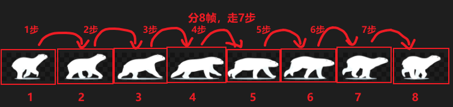

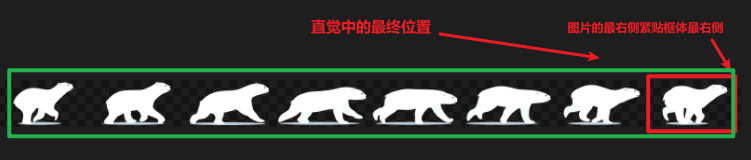

直觉中分8帧、走7步的代码效果如下：

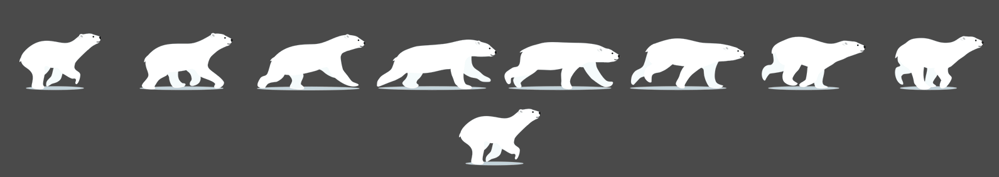

嗯哼？是不是觉得没啥区别，是不是觉得都一样？

其实仔细观察可以发现**最后一帧的动画一直都没有出现过**，只不过因为整个动画缺少这一个动作帧影响不大，才让你看起来觉得正常。我们换一张图片，让每一帧差异大一点，再来观察一下：

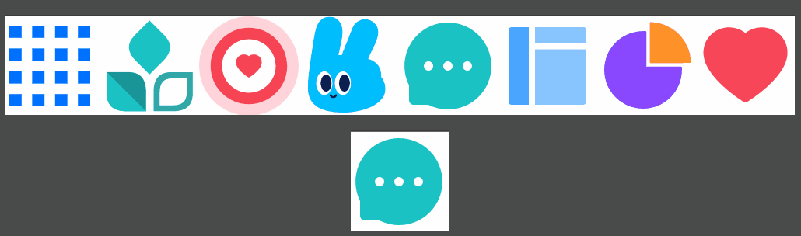

观察一下，会发现最后一个爱心图片永远都不会出现。

这是符合上述关于`end/jump-end`的解释的，即**每个动画状态显示的时间间隔结束时才会跳到下一状态，那么一个动画循环里的最后一个状态将不会有余留时间停留在我们的视野中**。

## steps()函数的第二个参数

`steps()`函数原型为
```
steps(num_of_steps, direction)
```

`num_of_steps`可以简单理解为整个动画过程要跳几步，要求是一个正整数

> Is a strictly positive \<integer\>, representing the amount of equidistant treads composing the stepping function.

`direction`按照MDN文档的解释是指定当前步进函数（阶跃函数）为左连续还是右连续函数

> Is a keyword indicating if it the function is left- or right-continuous

`direction`这个定义，包括MDN文档中关于每个不同取值的图例表示都让我甚是困惑，很难和浏览器中我看到的代码效果联系起来，所以我还是直接通过现象来总结规律吧

第二个参数的所有取值有：

```
jump-start/start
jump-end/end -- 默认取值
jump-both
jump-none
```

这里我借用一下网名为“果冻”的大佬的一篇[文章](https://segmentfault.com/a/1190000019371312/)中的一个张GIF，以便展示一下各个取值的不同表现：

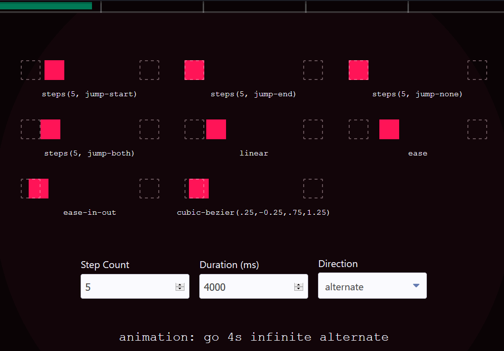

仔细观察，会发现在表现上，他们用了各自的5步完成了一个动画循环。这个动图需要结合最上边的绿条来观察，上面的绿条表示的是一个动画循环所需时间长度的时间条，当它从左到右移动一遍，动画就执行一次循环。这个绿条分成了5段，对应了5步每步之间的时间间隔。

先来看看前文提到过的`jump-end`取值，**`jump-end`表示的是在每个时间间隔结束的时候跳1步到下一状态位置**。所以可以观察到，当绿条每移动完一个小分段的一瞬间，红方块就跳一次，而当绿条移动完最后一个小分段的一瞬间（最后一个时间间隔结束的瞬间），实际上也发生了一次跳步的，只不过由于下一循环的第一个时间分段在上一个循环的最后一个时间分段结束的瞬间就开始了，画面被瞬间重置到了下一循环的起始状态，所以是看不到红方块停留在最后位置的画面的。

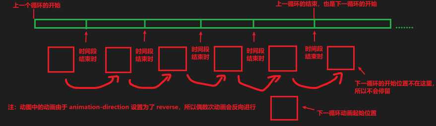

由于上述动图中的`animation-direction`设置为了`reverse`，所以动画会反向进行，现在我来将`reverse`去掉，让每次动画循环都同向，那么表现就会像下面这样：

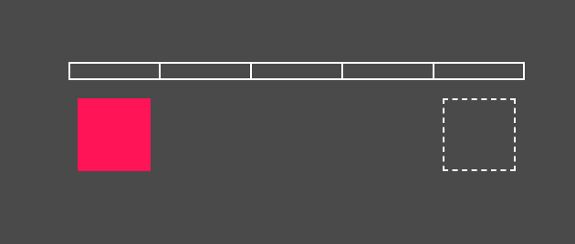

可以注意到，每次时间条走完之后，方块立马就回到原来位置开始下一次循环，根本不会在跳过去之后有时间停留。

那么`jump-start`又是怎么样的呢？**`jump-start`表示的是在每个时间间隔开始的时候跳1步到下一状态位置**（观察这一节最开始的GIF可以看出），我将去掉`reverse`的动画中的步进规则改成`step-start`，效果如下

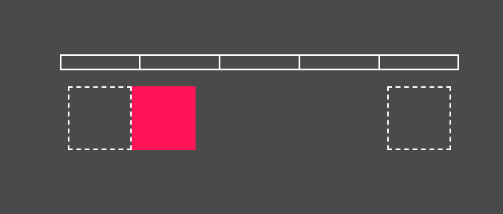

可以注意到，每个时间段开始的时候，方块就跳1步到下一动画状态，这就是红方块为什么一开始就不在开始位置。那么多次循环的时候，由于上一个循环的结束就是下一个循环的开始，下一循环开始的时候方块是没有时间让它停留在开始位置的。

那么剩下的`jump-both`和`jump-none`又是怎么样的呢？其实总结一下前两个就知道了，`jump-start`是在每个时间间隔开始时跳1步，`jump-end`是在每个时间间隔结束时跳1步，这些分别用`start`和`end`表示了。那么以此类推，`both`表示开始和结束都有，`none`标识开始和结束都没有，因此可以知道：

- **`jump-both`表示的是在每个时间间隔开始和结束的时候跳1步到下一状态位置**
- **`jump-none`表示的是在每个状态位置停留够一个时间间隔才跳到下一位置**

`jump-both`效果如下：

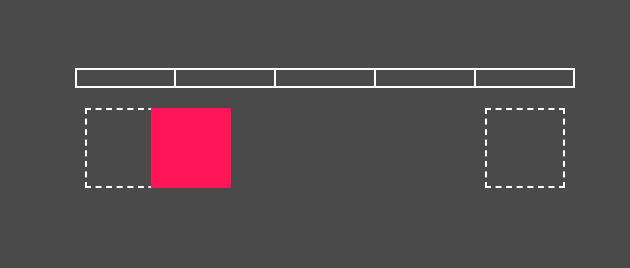

`jump-none`效果如下：


可以看到，`jump-both`实际上是跳了6步的，而`jump-none`是跳了4步的，而不是预设的5步，这是比较特殊的地方：**`jump-both`会比预设步数多1步，`jump-none`会比预设步数少1步**。

可以用一个动画循环时间长度的时间轴把以上四个取值的意思表示出来：

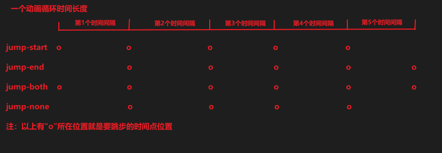

这样看起来，好像就能理解为什么这些取值要这样命名为`jump-*`，意思就是“在每个时间间隔的什么时候跳”。这里要提一下的是，在最开始的时候只有`jump-start`和`jump-end`这两个取值，并且取值是为`start`和`end`，并没有前缀`jump-`，后面加了`jump-both`和`jump-none`这两个取值，为了更好的表达出这个“什么时候跳”的意思，就统一加上的了`jump-`前缀。

另外可以看到，上述四个不同取值下，红色方块每一次跳步的位移距离是不一样的，这是因为浏览器会自动根据当前的`direction`取值和指定的步数，再根据在关键帧（`@keyframes`）中应用的CSS属性设置计算出在整个动画状态变化过程中的什么位置插值，再把插值位置的动画状态显示出来。比如，可以看出，当取值为`jump-both`时发生了六次插值，插值次数最多，也就是频次最高，为了在整个动画状态变化过程按照均匀跨度容下这六次插值，每次的偏移就比其他三个取值小点；而当取值为`jump-none`时发生了四次插值，插值次数最少，为了在整个动画状态变化过程按照均匀跨度容下这四次插值，每次的偏移就比其他三个取值大点。

其实最开始关于北极熊奔跑的动画，可以用`jump-none`实现，由于此时每个动画状态都会停留一个时间间隔，那么可以按照动画帧数分为8步，然后最终状态设置为最后一帧恰好在可视区域中：

```html
<div class="running-bear"></div>
```

```css
.running-bear {
    width: 200px;
    height: 100px;
    background: url(./bear.png) 0 / cover no-repeat;
    animation: run 1s steps(8, join-none) 0s infinite;
}

@keyframes run {
    to {
        background-position: 100%;
    }
}
```

### 总结

`jump-start`：在每个时间间隔开始的时候跳1步到下一状态位置；
`jump-end`：在每个时间间隔结束的时候跳1步到下一状态位置；
`jump-both`：在每个时间间隔开始和结束的时候跳1步到下一状态位置，跳步次数会比预设的多一次；
`jump-none`：在每个状态位置停留够一个时间间隔才跳到下一位置，跳步次数会比与预设的少一次

文章源码地址：https://gitee.com/thisismyaddress/bocheng-blogs/tree/master/css/CSS3%E5%8A%A8%E7%94%BB%E2%80%94%E2%80%94steps%E5%87%BD%E6%95%B0

参考：
> https://developer.mozilla.org/zh-CN/docs/Web/CSS/animation
> https://developer.mozilla.org/en-US/docs/Web/CSS/easing-function
> https://developer.mozilla.org/en-US/docs/Web/CSS/animation-delay
> https://juejin.cn/post/7056976054103048228
> https://segmentfault.com/a/1190000019371312/
