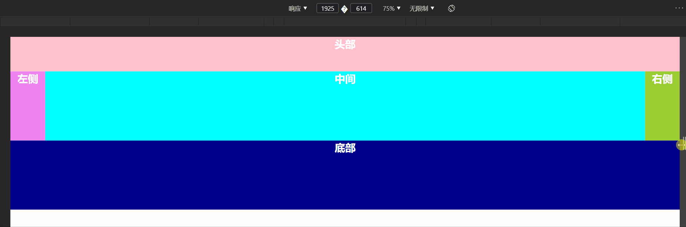
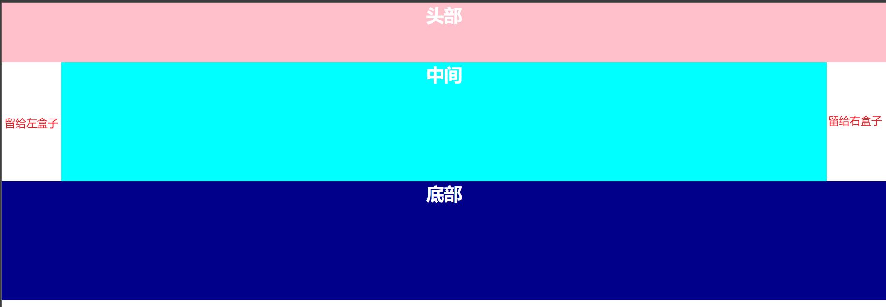
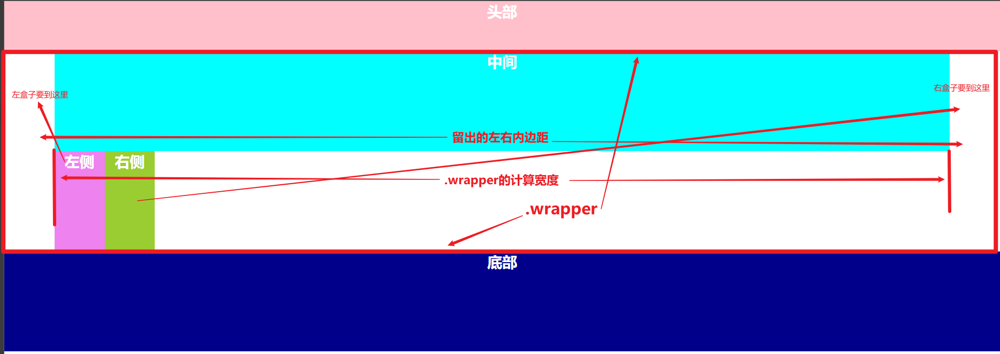
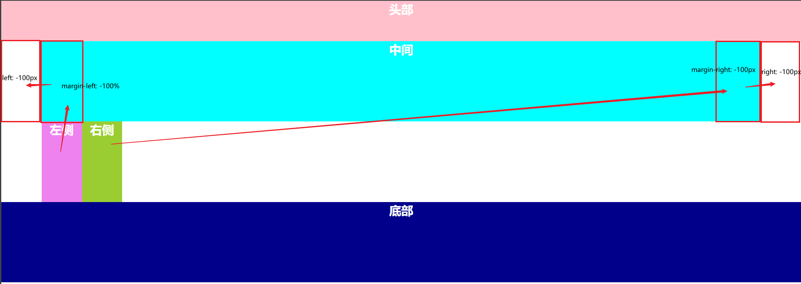
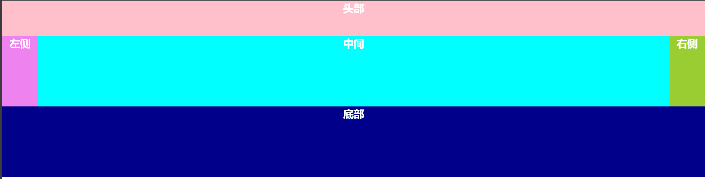
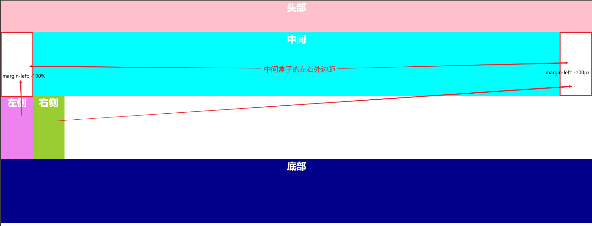

# 圣杯布局和双飞翼布局

这两个布局在实现上有差异（详见下文），但最终要实现的效果是一致的——即**保持两侧盒子不变，中间盒子随屏幕宽度变化而伸缩**

先放上最终要实现的效果



## 圣杯布局

在圣杯布局中，是将**左中右三个盒子都放到一个盒子中（`.wrapper`）进行浮动**，再通过**负外边距**和**相对定位**将左右盒子放置到中间盒子的两侧空白位置（这个实现也可以用其他方式可以探索出来）

这里要注意在编写代码时**中间盒子的代码要放在最前面**，这是为了后续能通过负外边距和相对定位将左右盒子放置到中间盒子的两侧空白位置

```html
<div class="wrapper">
    <!-- 注意：这里中间盒子写在最前面 -->
    <!-- 
        左中右三个盒子都是浮动的，中间盒子两侧留出了空白， 
        为了使左右两个盒子能放置到空白位置，需要应用到 水平负外边距 和 相对定位 
    -->
    <div class="center">中间</div>
    <div class="left">左侧</div>
    <div class="right">右侧</div>
</div>
```

为了给中间盒子两侧留出空白，需要对`.wrapper`设置特定样式，这里我通过左右内边距实现（实际上使用左右外边距效果一样）

```css
.wrapper {
    /* 这里设置为100px是因为在本次示例中左右盒子的宽度是100px */
    padding: 0px 100px;
}
/* 这里由于子盒子是浮动的，要清除浮动 */
.wrapper::after {
    content: "";
    display: block;
    clear: both;
}
.center {
    float: left;
    width: 100%;
    height: 200px;
    background-color: cyan;
}
```



接着只需要将左右盒子想办法放置到两侧的空白位置就可以了

先来看看没有设置样式将左右两个盒子放置到空白位置时的场景



为了使左右盒子能够到达中间盒子左侧和右侧位置，需要做以下样式设置

```css
.left {
    float: left;
    width: 100px;
    height: 200px;
    background-color: violet;
    /* 首先利用负外边距将左盒子移到和中间盒子“同一行”的位置 */
    /* 这里的 100% 是相对于父盒子.wrapper的宽度而言的，所以此时左盒子的左边恰好和中间盒子的左边重叠 */
    margin-left: -100%;
    /* 再通过相对定位将左盒子移到空白位置 */
    position: relative;
    left: -100px;
}
.right {
    float: left;
    width: 100px;
    height: 200px;
    background-color: yellowgreen;
    /* 首先利用负外边距将右盒子移到和中间盒子“同一行”的位置 */
    /* 这里的 100px 是右盒子的宽度，此时右盒子的右边恰好和中间盒子的右边重叠 */
    margin-left: -100px;
    /* 再通过相对定位将右盒子移到空白位置 */
    position: relative;
    right: -100px;
}
```



至此，就可以实现最终效果啦！！！



## 双飞翼布局

这里左中右三个盒子，**只有中间盒子需要一个父盒子（`.wrapper`）来包裹**，左右盒子不需要；

**浮动的三个盒子为左右两个盒子，以及包裹中间盒子的父盒子**，中间盒子不需要浮动；

**中间盒子的相关代码还是写在最前面**；
利用**负外边距**将左右盒子的放置在中间盒子两侧的空白区域

```html
<!-- 左中右三个盒子只要用一个盒子包裹中间盒子即可 -->
<!-- 注意：这里中间盒子写在最前面 -->
<!-- 
    左右两个盒子，以及包裹中间盒子的盒子都是浮动的，中间盒子不浮动 
    为了使左右两个盒子能放置到空白位置，需要应用到 水平负外边距 
-->
<div class="wrapper">
    <div class="center">中间</div>
</div>
<div class="left">左侧</div>
<div class="right">右侧</div>
```

这里为了给中间盒子两侧留出空白，需要对中间盒子应用左右外边距

```css
.wrapper {
    float: left;
    /* 这里包裹中间盒子的父盒子的宽度要占据一整行，将左右盒子“挤下去” */
    width: 100%;
}
.center {
    height: 200px;
    background-color: cyan;
    /* 设置左右外边距留出空白 */
    margin: 0px 100px;
}
/* 由于左中右三个浮动的盒子并没有用一个共同的父盒子包裹起来，为了清除浮动，在底部元素应用相关样式来进行清除浮动 */
footer {
    /* 在这里清除浮动 */
    clear: both;
    width: 100%;
    height: 200px;
    background-color: darkblue;
}
```

接下来只需要将左右两个盒子放置到空白位置就好了。这里需要进行的样式设置是**设置负外边距**

```css
.left {
    float: left;
    width: 100px;
    height: 200px;
    background-color: violet;
    /* 设置左负外边距，这里的 100% 是相对于左盒子的父元素宽度的，
       此时左盒子的父元素宽度是 body ，因此也就是整个视窗的宽度，
       最后的效果是左盒子的左侧和屏幕的左侧（也是.wrapper的左侧）重叠 */
    margin-left: -100%;
}

.right {
    float: left;
    width: 100px;
    height: 200px;
    background-color: yellowgreen;
    /* 设置左负外边距，最后的效果是右盒子“回到上一行”，右盒子的右侧和屏幕的右侧（也是.wrapper的右侧）重叠 */
    margin-left: -100px;
}
```



## 总结

对比圣杯布局和双飞翼布局可以发现，**在HTML代码上，圣杯布局的可读性更好**，不像双飞翼布局突然地就拿个盒子包裹中间盒子，圣杯布局是包裹了左中右盒子，一看上去就知道这三个盒子是一个模块的；

在设置浮动时，**圣杯布局要对左中右三个盒子设置浮动，而双飞翼布局要对左右盒子和包裹中间盒子的父盒子设置浮动**；

清除浮动时，**圣杯布局要对包裹左中右盒子的父盒子应用清除浮动样式**，而**双飞翼布局**的左中右三个浮动盒子没有共同的父盒子，只能**对其后面的盒子应用清除浮动样式**；

将左右盒子移动到目标位置时，**圣杯布局要设置的CSS样式多一点**，而**双飞翼布局只需要应用负外边距**就可以了

整个的这么一个布局主要还是**在于对负外边距应用的考察**

文章源码：<>

参考：

><https://www.bilibili.com/video/BV17J411x7Mo?spm_id_from=333.999.0.0>
