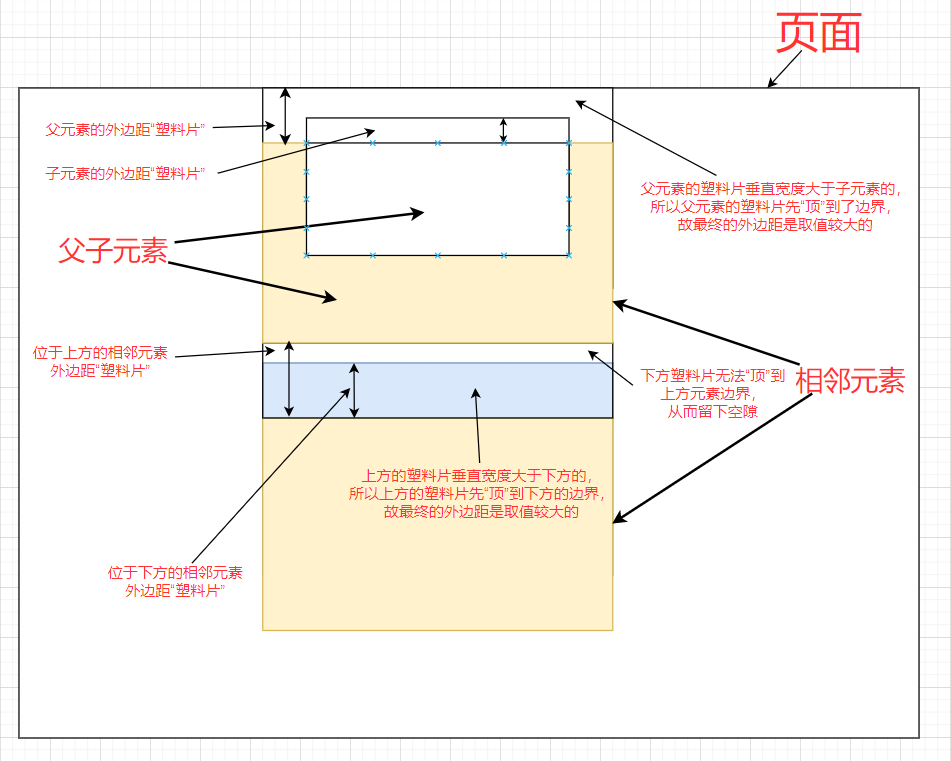
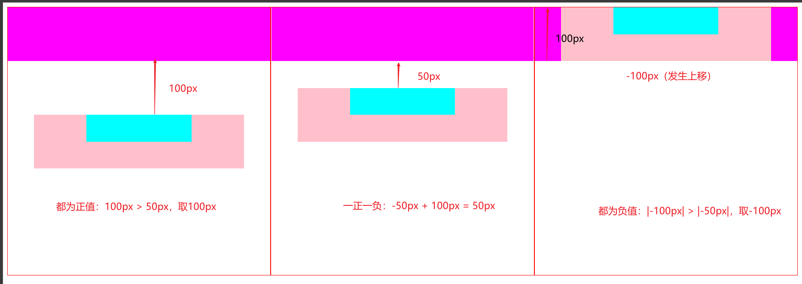
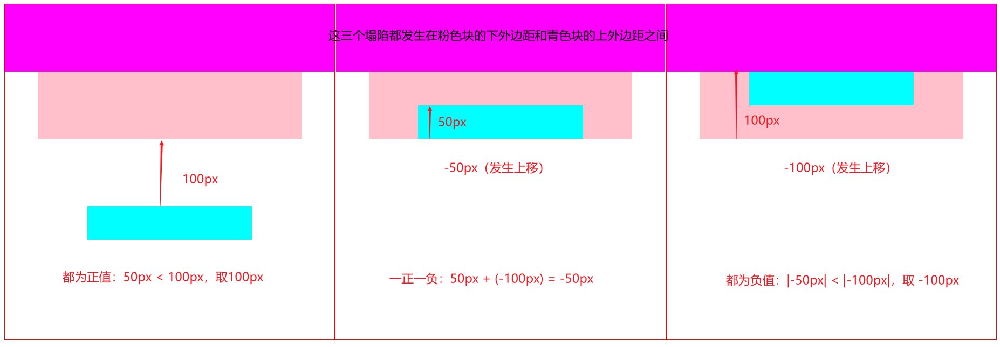
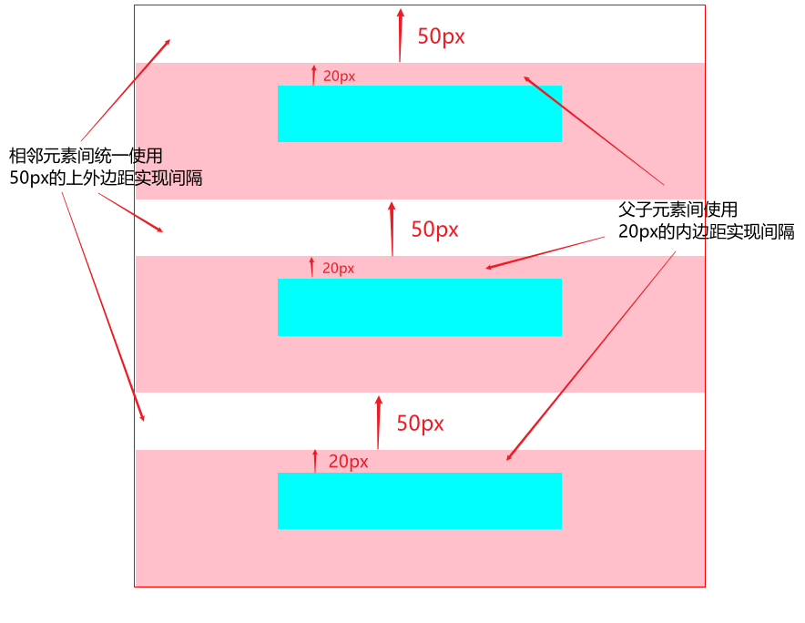
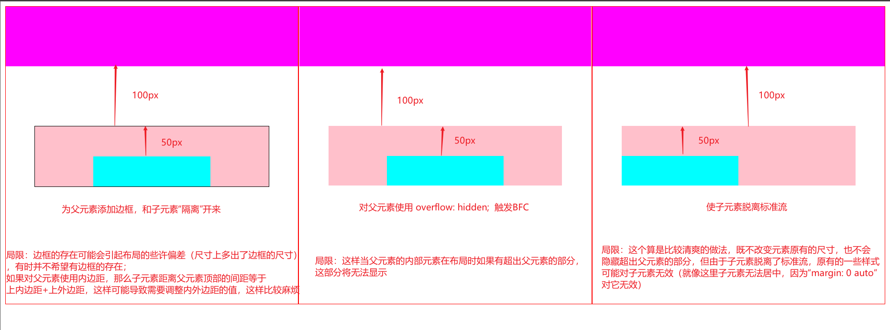

# 相邻垂直外边距的塌陷

首先需要明确塌陷只会发生在**块级元素**的**相邻垂直外边距**间

在使用CSS的垂直外边距样式时，**相邻元素**和**父子元素**都有可能发生**相邻垂直外边距**的塌陷（相邻元素是上方元素的下外边距和下方元素的上外边距之间，父子元素是父元素的上外边距和子元素的上外边距之间），为了在编写静态页面时避免由于垂直外边距的塌陷导致的布局混乱，需要了解塌陷时垂直外边距的表现和产生的原因——知道原因才能更好的解决问题

## 塌陷时外边距的计算方式

*在《CSS权威指南》一书中对这种塌陷发生的描述非常的生动，书中将包围元素的外边距**比作透明的塑料片**，当上下相邻的元素的外边距相邻时，塑料片的垂直宽度大的先触碰到塑料片垂直宽度小的元素的边界，所以塌陷时，保留的是垂直宽度大的外边距值；当父子元素的外边距相邻时，是塑料片垂直宽度大的先触到其他元素或页面的边界，所以塌陷发生时也是保留垂直宽度大的外边距值*



以下明确塌陷发生时相邻垂直外边距的取值方式：

- 相邻的垂直外边距都为正值，取值较大的
- 相邻的垂直外边距都为负值，取绝对值较大的
- 相邻的垂直外边距一正一负，取这两个数的和

## 父子元素的垂直外边距塌陷

**父子元素之间**的外边距塌陷发生在**父元素的上外边距**和**子元素的上外边距**之间，取值方式如上所述



主要代码如下：

```html
<!-- 以上三组父子元素的HTML结构 -->
<!-- 第一组 -->
<div class="parent" style="margin-top: 100px;">
    <div class="son" style="margin-top: 50px;"></div>
</div>

<!-- 第二组 -->
<div class="parent" style="margin-top: 100px;">
    <div class="son" style="margin-top: -50px;"></div>
</div>

<!-- 第三组 -->
<div class="parent" style="margin-top: -100px;">
    <div class="son" style="margin-top: -50px;"></div>
</div>
```

## 相邻元素的垂直外边距塌陷

**相邻元素之间**的外边距塌陷发生在**上方元素的下外边距**和**下方元素的上外边距**之间



主要代码如下：

```html
<!-- 以上三组相邻元素的HTML结构 -->
<!-- 第一组 -->
<div class="sibling1" style="margin-bottom: 100px;"></div>
<div class="sibling2" style="margin-top: 50px;"></div>

<!-- 第二组 -->
<div class="sibling1" style="margin-bottom: 50px;"></div>
<div class="sibling2" style="margin-top: -100px;"></div>

<!-- 第三组 -->
<div class="sibling1" style="margin-bottom: -50px;"></div>
<div class="sibling2" style="margin-top: -100px;"></div>
```

## 防止垂直外边距塌陷的方法

要说明一下的是，垂直外边距的塌陷是发生在相邻的垂直外边距之间的，**只要不对紧邻在一起的块级元素使用相邻的垂直外边距，是不会有这种塌陷问题的**。所以在进行静态布局时，规范的做法往往是：相邻元素的（上下相邻或左右相邻）间隔用外边距实现，并且垂直外边距统一使用一侧的外边距（上外边距或下外边距），而父子元素的（上下间距或左右间距）间隔用内边距实现



主要代码如下：

```html
<!-- HTML结构如下 -->
<div class="con">
    <div class="parent">
        <div class="son"></div>
    </div>
    <div class="parent">
        <div class="son"></div>
    </div>
    <div class="parent">
        <div class="son"></div>
    </div>
</div>
```

```css
.parent {
    /* 统一使用 上外边距 实现 相邻元素间 的间隔 来 避免塌陷问题 */
    margin-top: 50px;
    /* 使用 内边距 来 实现 父子元素 的间隔 */
    padding-top: 20px;
}
```

### 防止父子元素的垂直外边距塌陷

当**父子元素**的垂直外边距塌陷发生时，主要有三种方式解决这个问题：

- **避免父子元素紧贴彼此**：使用边框或内边距将父子元素隔开
- **触发BFC**：典型的，可以对父元素使用`overflow: hidden`触发
- **使子元素脱离标准流（提高子元素的层叠上下文）**：对子元素使用绝对定位或进行浮动

但以上做法有各自的局限性（见下图解析）



主要代码如下:

使用边框或内边距：
边框的存在可能会引起布局的些许偏差（尺寸上多出了边框的尺寸），有时并不希望有边框的存在；如果对父元素使用内边距，那么子元素距离父元素顶部的间距等于 上内边距+上外边距 ，这样可能导致需要调整内外边距的值，这样比较麻烦

```html
<!-- 添加边框或内边距 -->
<div class="parent" style="border: 1px solid black;">
    <!-- <div class="parent" style="padding: 1px;"> -->
    <div class="son"></div>
</div>
```

使用`overflow: hidden`：
当父元素的内部元素在布局时如果有超出父元素的部分，这部分将无法显示

```html
<!-- 触发BFC -->
<div class="parent" style="overflow: hidden;">
    <div class="son"></div>
</div>
```

使子元素脱离标准流：
这个算是比较清爽的做法，既不改变元素原有的尺寸，也不会隐藏超出父元素的部分，但由于子元素脱离了标准流，原有的一些样式可能对子元素无效（就像这里子元素无法居中，因为“margin: 0 auto”对它无效）

```html
 <!-- 使子元素脱离标准流：绝对定位或浮动 -->
<div class="parent" style="position: relative;">
    <div class="son" style="position: absolute"></div>
    <!-- <div class="son" style="float: left;"></div> -->
</div>
```

由于以上做法各有各的局限，所以还是建议按照以下做法实现元素间的间隔：*相邻元素的（上下或左右）间隔用外边距实现，并且垂直外边距统一使用一侧的外边距（上外边距或下外边距），而父子元素的（上下或左右）间隔用内边距实现*

### 防止相邻元素的垂直外边距塌陷

相邻元素的相邻垂直外边距的塌陷是无法避免的，**只能通过其他等价方式将间距实现出来**

比如如果希望上方元素和下方元素有150px间隔，直接对上方元素使用`margin-bottom: 150px`就好了，或者只对下方元素使用`margin-top: 150px`

## 总结

垂直外边距的塌陷问题完全可以通过不使用相邻的垂直外边距避免，所以在实际的应用中就不太应该使用相邻的垂直外边距。而是应该按照以下原则：
**相邻元素的（上下相邻或左右相邻）间隔用外边距实现，并且垂直外边距统一使用一侧的外边距（上外边距或下外边距），而父子元素的（上下间距或左右间距）间隔用内边距实现**

如上规范地使用内外边距，可以直接避免塌陷问题

文章源码：<https://gitee.com/thisismyaddress/bocheng-blogs/tree/master/css/%E7%9B%B8%E9%82%BB%E5%9E%82%E7%9B%B4%E5%A4%96%E8%BE%B9%E8%B7%9D%E7%9A%84%E5%A1%8C%E9%99%B7>

参考：
><https://www.bilibili.com/s/video/BV1DE41197Kc>  
><https://developer.mozilla.org/zh-CN/docs/Web/CSS/margin>
