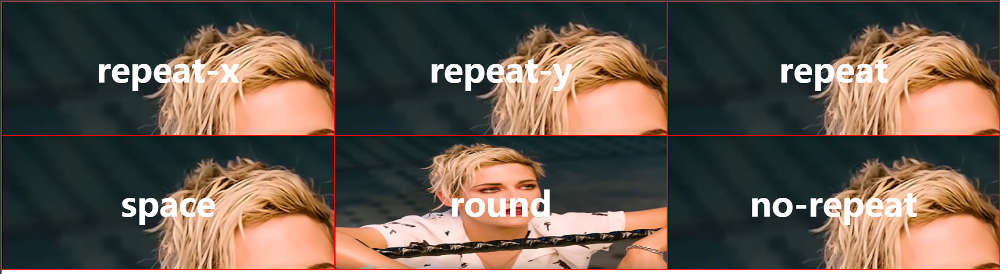
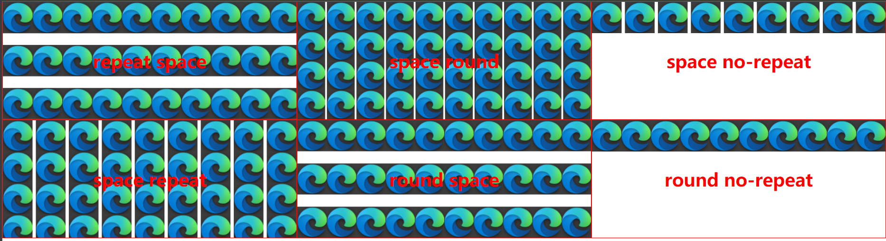

# 背景平铺background-repeat的取值探究

背景平铺的取值决定了背景图片在可视区域背景中的重复方式

## background-repeat的取值

`background-repeat`可取的值为：

```css
repeat-x | repeat-y | [ repeat | space | round | no-repeat ]{1, 2}
/* 
repeat-x 和 repeat-y 只能用于单值语法，其余值可以用于单值和双值语法
*/
```

以下为对各取值作用的简要描述

| 取值        | 作用                                                         |
| :---------- | ------------------------------------------------------------ |
| `repeat-x`  | 仅在**水平方向上重复**背景图片，水平方向上重复的最后一张背景图片如果容不下会被裁剪 |
| `repeat-y`  | 仅在**垂直方向上重复**背景图片，垂直方向上重复的最后一张背景图片如果容不下会被裁剪 |
| `repeat`    | 背景图片会在**水平和垂直方向上重复**，水平或垂直方向上重复的最后一张背景图片如果容不下会被裁剪 |
| `space`     | 图像会尽可能得重复，**一般不会裁剪**（除非图像太大无法容下，此时“溢出”部分被裁剪）<br />第一个和最后一个图像会被固定在元素的相应的边上，同时空白会均匀地分布在图像之间<br />除非只有一个图像能被无裁剪地显示（这等同于使用`no-repeat`），否则`background-position`属性会被忽视<br />——**可以将图像均匀的分布在背景中** |
| `round`     | 如果背景空间在尺寸上增长，被重复的图像将会伸展(没有空隙)，直到有足够的空间来添加一个图像<br />当可以添加一个新的图像时，所有的当前的图像会被压缩来腾出空间，此时原有图片会适当压缩<br />这是由浏览器决定什么时候应该添加一个图像进来，而不是继续伸展<br />——可以**自主的缩放背景图片**，将图片完整的放入背景中（即使图片过大也可以被完整放进来） |
| `no-repeat` | 图像不会被重复(背景图像所在的区域将可能没有完全被覆盖)<br />那个没有被重复的背景图像的位置是由`background-position`属性来决定 |

以上取值的效果如下：


`round`取值的特殊之处在于，它绝不会对图片进行任何的裁剪。以下给每个盒子一张很大的背景图片，只有取值为`round`时图片是完整的，因为它能使浏览器对图片进行适当伸缩，以便显示完整图片



## 双值语法

`background-repeat`有单值语法和双值语法，**单值语法**就是只**使用一个可取值**，**是双值语法的一种省略形式**（如下表），也是常用的形式；所谓**双值语法**就是对`background-repeat`设置值的时候**设置两个允许的值**，这两个值用空格分隔，**第一个值用于表示水平重复行为，第二个值用于表示垂直重复行为**

|  **单值**   |    **等价于双值**     |
| :---------: | :-------------------: |
| `repeat-x`  |  `repeat no-repeat`   |
| `repeat-y`  |  `no-repeat repeat`   |
|  `repeat`   |    `repeat repeat`    |
|   `space`   |     `space space`     |
|   `round`   |     `round round`     |
| `no-repeat` | `no-repeat no-repeat` |

由上表可知，单值语法的任何取值都是双值语法的一种省略，是双值语法下对背景图片的水平重复行为和垂直重复行为分别进行设置的结果

单值语法下各个取值的结果可以在理解各个取值的作用的情况下，很容易地猜测出来大概是什么效果。而双值语法下，取值的组合更多，并且有许多组合效果是单值语法无法办到的，尤其是当使用双值语法时，如果使用了`round`或`space`，会出现比较多的不常见的背景图片平铺效果

但在双值语法下，`repeat-x`和`repeat-y`是不可用的

以下给出若干种双值语法下不同取值的效果



文章源码：<https://gitee.com/thisismyaddress/bocheng-blogs/tree/master/css/%E8%83%8C%E6%99%AF%E5%B9%B3%E9%93%BAbackground-repeat%E7%9A%84%E5%8F%96%E5%80%BC%E6%8E%A2%E7%A9%B6>

参考：
> <https://developer.mozilla.org/zh-CN/docs/Web/CSS/background-repeat>
