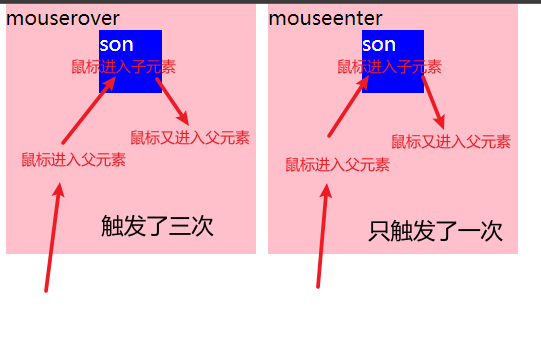
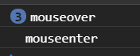

# 由mouseover和mouseenter引发的思考

这是两个都是鼠标移入事件，首先要明确的是**`mouseover`可以冒泡，而`mouoseenter`无法冒泡**，这是它们的最根本区别

## 示例说明

这两者间的区别可以明显体现在父子元素间

示例主要代码：

```html
<div class="parent-over">
    mouserover
    <div class="son-over">son</div>
</div>

<div class="parent-enter">
    mouseenter
    <div class="son-enter">son</div>
</div>
```

```js
const over = document.querySelector(".parent-over");
const enter = document.querySelector(".parent-enter");

over.addEventListener("mouseover", function() {
    console.log("mouseover");
});
enter.addEventListener("mouseenter", function() {
    console.log("mouseenter");
});
```

通过以上代码构造两对父子元素，一个父亲元素绑定`mouseover`，另一个父亲元素绑定`mouseenter`

虽然`mouseover`和`mouseenter`都是鼠标移入事件，但当鼠标在父子元素间移动时，左侧和右侧的鼠标移入事件触发的结果是不同的：

当鼠标进入左侧绑定了`mouseover`事件的父级元素时，会触发绑定在父元素的`mouseover`事件，当鼠标继续移动进入蓝色背景的子元素时，左侧的子元素会触发再次触发该事件，从左侧子元素移动回粉色区域时，父元素又会触发一次该事件（共3次）

而当鼠标进入右侧绑定了`mouseenter`的父级元素时，会触发绑定在父元素的`mouseenter`事件，但只要鼠标不离开右侧粉色区域，鼠标无论如何在父子元素间移动，都不会再触发该事件（除非鼠标离开右侧粉色区域后再进入）（共1次）



查看控制台打印的信息，左侧的`mouseover`被触发了3次，右侧被触发了1次



这两者的区别就是由**`mouseover`可以冒泡，而`mouoseenter`无法冒泡**导致的：

对于左侧：当鼠标第一次进入父元素时，自然会触发鼠标移入事件，执行一次事件处理函数，这是第1次；当鼠标继续移动进入子元素时，此时并没有在子元素绑定`mouseover`的事件处理函数，但由于`mouseover`会冒泡，因此向上冒泡到父元素时会触发绑定了处理函数的`mouseover`，这是第2次；当鼠标从子元素移动到父元素时，会再次触发该事件，因为此时认为是从父元素外的区域“进入”，这是第3次，所以共有3次

对于右侧：当鼠标第一次进入父元素时，自然会触发鼠标移入事件，执行一次事件处理函数，这是第1次；当鼠标移入子元素时，并不能触发事件，因为`mouseenter`不冒泡，因此不能触发父元素的`mouseenter`事件；当鼠标从子元素移动到父元素时，也不会触发事件，因为此时依然看作是在父元素中来回移动而已，所以只有1次

对于这两个鼠标移入事件，有两个对应的鼠标移出事件：
`mouseover`对应于`mouseout`
`mouseenter`对应于`mouseleave`

`mouseout`和`mouseleave`的根本区别在于前者可以冒泡，而后者不能，这点和两个鼠标移入事件类似

## 为什么要同时有两种鼠标移入（两种鼠标移出）事件？

这里给出我个人的思考

首先要知道`mouseenter`是在捕获阶段执行事件处理函数的，而不能在冒泡阶段过程中进行；`mouseout`是可以在捕获阶段和冒泡阶段选择一个阶段来执行事件处理函数的（默认为冒泡阶段）

我们可以阻断冒泡（`stopPropagation()`），而捕获是不可阻断的（当有事件被触发时，事件流的传播是从DOM树的最顶层的 document 向下传播寻找事件源的，当找到了事件源就会停止向下传播，而捕获的方向就是这个方向。当找到事件源后就要返回，这个过程就是冒泡阶段）

**当父元素和子元素都要绑定鼠标移入事件时**：

`mouseenter`事件处理函数的执行是在捕获阶段进行的，假如子元素的`mouseenter`事件被触发了，事件流必然会经过其父元素，父元素此时也绑定了`mouseenter`事件，那么就必然会先触发父元素的`mouseenter`事件并执行对应的事件处理函数，然后再执行子元素上的事件处理函数。捕获阶段是不可阻断的，所以父元素和子元素的`mouseenter`事件同时被触发是不可避免的。有时我们只希望触发子元素的事件，这时就需要利用`mouseover`

`mouseover`可以冒泡，当父子元素都绑定了`mouseover`事件，如果希望触发子元素的`mouseover`事件时不触发父元素的`mouseover`事件，那么只需要利用`stoppropagetion()`阻止冒泡即可，这就可以实现`mouseenter`不能实现的（即无法避免在触发子元素鼠标移入事件时，父元素的鼠标移入事件也被触发的情况）（算是弥补`mouseenter`的“缺陷”）

**当只有父元素绑定鼠标移入事件，而子元素不绑定时**：

`mouseover`默认是在冒泡过程中执行事件处理函数，而由于事件可以冒泡，当子元素的`mouseover`事件被触发后，也会触发父元素的`mouseover`事件。当我们在这时使用`mouseover`，因为子元素并没有绑定任何相关事件，如果我们不希望在鼠标移入子元素时触发父元素的`mouseover`事件，就必须为子元素特地去添加一个仅含有阻止冒泡操作的事件处理函数（如下），否则当鼠标移入子元素时就会触发一次父元素绑定的`mouseover`事件。这种情况下使用`mouseenter`是更加简练的方式——`mouseenter`不能冒泡，那么直接应用`mouseenter`则只会触发父元素，当鼠标进入子元素时，也不会再次触发父元素

```js
// 仅含阻止子元素冒泡操作的事件处理函数
son.addListener("mouseover", function(e) {
    e.stopPropagation();
});
```

**当只有子元素绑定鼠标移入事件，而父元素不绑定时**：

使用哪个效果都一样

综上，当父子元素都需要绑定鼠标移入事件，并希望独立地触发对应元素的事件时（当移入父元素时只触发父元素的，当移入子元素时只触发子元素的），应当选用`mouseover`事件，并在子元素中使用`stopPropagation()`来阻止冒泡；\
当只有父元素需要绑定鼠标移入事件，并希望移入父元素区域后不要反复触发事件时，使用`mouseenter`事件会比较方便，因为如果使用会冒泡的`mouseover`事件，需要额外为子元素添加仅含阻止冒泡操作的事件处理函数，会增加内存开销

（对于`mouseout`和`mouseleave`的分析类似以上）

## 引发的关于`click`的思考

`click`和`mouseenter`相反，`click`只能在冒泡阶段过程中执行事件处理函数，而不能在捕获阶段过程中。这又是为什么呢？以下给出我的个人见解

对于点击事件，我们希望的是一种“精准的点击效果”，也就是当我们点击了一个元素，我们往往希望的是只触发绑定在这个元素上的点击事件，而不触发其他元素的点击事件（往往是父元素的）。对于父子元素都绑定了点击事件的情况来说，如果要实现父子元素的点击事件独立触发，只需要阻止子元素的点击事件冒泡即可。那如果`click`可以在捕获阶段过程中执行事件处理函数应该也不影响吧？

接下来我假设`click`可以在捕获阶段过程中执行事件处理函数

我们知道，大多数事件都可以选择在两个阶段中的一个执行事件处理函数，默认都是在冒泡阶段。可以通过将`addEventListener()`的`capture`参数设置为`true`实现在捕获阶段执行处理函数，那么如果将`click`设置在捕获阶段执行事件处理函数，其父元素如果有点击事件的话，就会总是在子元素点击事件处理函数执行前执行父元素的执行函数。对于点击效果来说，应该是“点哪从哪开始触发”，捕获阶段的效果显然是，“点哪随便从哪有绑定点击事件的地方开始触发”，这时如果祖先元素也有点击事件，整个点击效果将会十分不符合预期，鼠标本来点击的元素绑定的事件处理函数却在最后才执行（或许还会因为其他点击事件的作用而根本无法执行，比如某个父级元素的点击事件包含页面跳转操作，或删除点击的目标子元素的操作）

由此可见，`click`根本没有在捕获阶段执行事件处理函数的需要

文章源码：<>

参考：
><https://developer.mozilla.org/zh-CN/docs/Web/API/Event/stopPropagation>\
><https://developer.mozilla.org/zh-CN/docs/Web/API/Element/mouseenter_event>\
><https://developer.mozilla.org/en-US/docs/Web/API/Element/mouseover_event>
