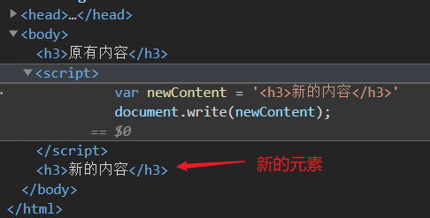
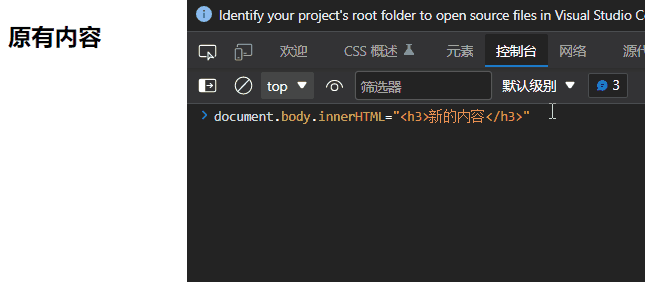
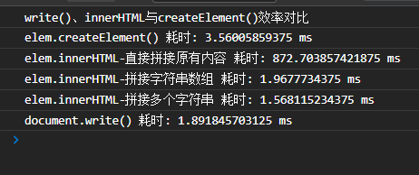

# 创建 DOM 元素的几种方式

## document.write()

`document.write()`是向文档写入内容，参数是一个将要被写入 HTML 文档的字符串

```js
document.write(markup);
```

*类似的还有一个`document.wirteln()`，只是最后紧跟一个换行符*

如果字符串中有标签元素，会被解析并在文档中**创建一个对应元素节点**

写入一个新元素")



但如果在**文档加载完毕后才调用**`document.write()`，则会**重写整个文档**，将之前所有的内容覆盖

```html
<!-- 这里为了在文档加载后才调用 write() ，需要使用到 加载事件onload -->
<body>
    <h3>原有内容</h3>

    <script>
        var newContent = '<h3>新的内容</h3>'
        document.write(newContent);

        // 文档加载完毕再通过 write() 写入内容
        window.onload = function() {
            document.write('<h3>旧的不走，新的不来</h3>');
        }
    </script>
</body>
```

")

对比上一张图会发现，`body`中的`script`的内容也没了，这是因为重写后只保留`write()`写入的值。事实上，除了主要的几个标签，原有的都没了

## document.createElement()

通过`document.createElement()`可以**创建一个元素节点**，需要通过`document.appendChild()`或其他等效的DOM节点操作**将创建的新元素节点添加到文档中才能呈现新的节点内容**。其参数是新节点的标签名称

```js
document.createElement(tagName);
// 还有个可选参数 options ，为了一些兼容问题，一般不用考虑
```

创建一个新的元素")

## elem.innerHTML

`elem.innerHTML`是所有元素节点都有的**一个属性**，**给它赋值（字符串）可以往标签元素里添加内容**，也可以直接通过该属性获取元素节点的原有内容

如果**直接赋值添加内容，会将原有内容覆盖掉**



实际上还可以通过`elem.innerHTML = ''`达到清空元素内容的效果

## 三者效率对比

为了对比一下三种方式的效率，分别让它创建1000个超链接



（相关实现代码见文章源码链接）

结果表明，重复1000次添加超链接，`elem.innerHTML`是最慢的，但如果直接将一个有1000个超链接的字符串赋值给元素的`innerHTML`，则可以在很短时间内完成；

使用`elem.createElement()`和`document.write()`所用的时间相近，并且经过多次测试发现，`elem.createElement()`要么和`document.write()`差不多速度，要么比`document.write()`慢点，这可能是因为通过`elem.createElement()`创建元素时，还需要进行添加节点到文档中的操作导致效率低了一点。

## 总结

以上三种创建元素的方式作用可以是相同的，但实现方式、效率有差异

`document.write()`和`elem.createElement()`是**方法**，但前者只能由`document`调用，并且是通过将HTML字符串转化为元素节点的方式创建元素，而`elem.createElement()`是一次创建一个元素节点，并且一定要进行添加节点到文档中的操作才能呈现节点。`elem.innerHTML`是一个**属性**，也是通过将HTML字符串转化为元素节点的方式创建元素，在进行重复添加元素节点的操作时，它的效率会低一点

文章源码：<>

参考：
><https://developer.mozilla.org/zh-CN/docs/Web/API/Element/innerHTML>\
><https://developer.mozilla.org/zh-CN/docs/Web/API/Document/write>\
><https://developer.mozilla.org/zh-CN/docs/Web/API/Document/createElement>
