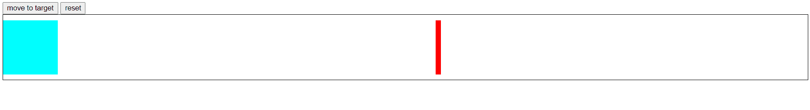

# 实现简单的缓动函数

如果使用过CSS的`animation`属性或`transition`属性，应该会对`ease`、`ease-in`等缓动函数（easing function）有印象，这些函数能够在动画过程中改变变化的速度

这里作为练习，我实现一个移动速度逐渐变慢的缓动函数（可能在变化上不太严谨）

## 实现

通过缓动函数实现一个**绝对定位的方块左右移动时速度慢慢降下来的缓动效果**

这里使用到的JS内置API有以下几个：

```js
// 获取元素左侧和带有定位的父元素左侧的距离，不带单位（px）
elem.offsetLeft;

// 实现速度变化的关键。实现速度变化的实质就是实现 每个相同时间间隔后，移动的距离逐渐变小
// 设置定时器
window.setInterval(callback, interval);
// 清除定时器
// 每次开始使用缓动函数时都要清除之前的定时器，防止出现混乱
// 在以下实现的缓动函数中也用于在到达目标位置后停止定时器
window.clearInterval(timerID);

// 用于对步长 step 进行取整（详见下面代码）
Math.ceil();
Math.floor();
```

首先确定缓动函数的“雏形”为：

```js
function animateEase(obj, target, callback) {
    // 方法体
}
/*
  obj 表示函数应用的元素对象
  target 表示对象要移动到的目标位置
  callback 是函数执行完之后的执行的回调函数
*/
```

首先要明确的是使用在缓动函数前要

1、清除之前应用在该元素对象上的缓动函数定时器\
2、要在元素对象到达目标位置后停止定时器，并执行回调函数

```js
function animateEase(obj, target, callback) {
    // 1、清除之前可能存在的该函数应用到该元素的定时器
    // 这是个添加给元素对象的自定义属性，如果一开始并没有给这个对象应用该函数，则 obj.timer 为 undefined
    clearInterval(obj.timer);
    let interval = 30; // ms
    obj.timer = setInterval(() => {
        // 实现 每次相同时间间隔后 移动的距离逐渐变小
        // 2、如果到达目标位置则需要通过清除定时器来停止移动
        // 这里的示例是想使元素左右移动，判断的是 左侧偏移距离 
        if(target == obj.offsetLeft) {
            clearInterval(obj.timer);
            // 执行回调函数——可能调用缓动函数时并没有传入回调函数，先判断有没有传入
            if(callback) {
                callback();
            }
        }
    }, interval);
}
```

接下来只需要实现每次相同时间间隔后移动的距离逐渐变小的逻辑代码即可：

```js
function animateEase(obj, target, callback) {
    clearInterval(obj.timer);
    
    let interval = 30; // ms
    obj.timer = setInterval(() => {
        // 实现 每次相同时间间隔后 移动的距离逐渐变小
        // 1、计算当前步长大小——步长会随着与目标位置的距离变小而变小（速度因此变慢）
        let step = (target - obj.offsetLeft) / 10;
        // 由于在应用数值到元素时，过小数会被省略掉（一般 1px 以下就会被忽略），这会造成最终到达的位置和目标位置有偏差，所以需要进行取整
        // 这里取整有两种情况（当绝对值小于 1 都取值为 1 ）：
        // 向右移动，step 为正数，向上取整
        // 向左移动，step 为负数，向下取整
        step = step > 0 ? Math.ceil(step) : Math.floor(step);
        // 2、应用到元素上
        // 这里将步长应用到左侧边移量是因为本次示例的目标是使元素左右移动出现缓动效果
        // 由于计算值不带单位，需要通过字符串拼接来添加单位，再应用到样式中
        obj.style.left = obj.offsetLeft + step + 'px';
        
        if(target == obj.offsetLeft) {
            clearInterval(obj.timer);
            if(callback) {
                callback();
            }
        }
    }, interval);
}
```

最后的效果如下：



至此一个简单缓动效果就实现了

文章源码：<https://gitee.com/thisismyaddress/bocheng-blogs/tree/master/js/%E5%AE%9E%E7%8E%B0%E7%AE%80%E5%8D%95%E7%9A%84%E7%BC%93%E5%8A%A8%E5%87%BD%E6%95%B0>
