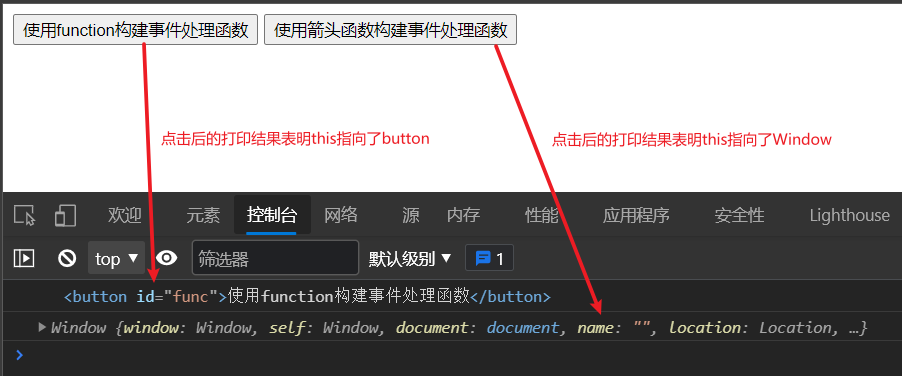
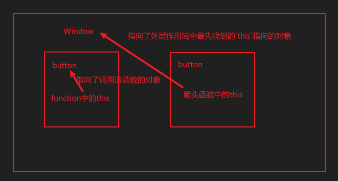
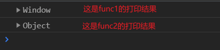
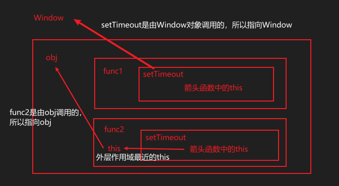

# 箭头函数的this指向

这里先明确一点：箭头函数的 this 指向比较特殊，它总是指向其最近的外层**函数作用域**的 this 所指对象

## 箭头函数

箭头函数为以下形式的函数

```js
const func = (paramList) => {
    // 函数体
}
```

按照习惯，将箭头函数作为单独一个函数来使用的情况并不多，往往是当要传入的参数是函数时才使用箭头函数

```js
// 比如事件处理函数
elem.addEventListener("click", () => {
    // 函数体
})
```

## this在函数中的指向

我们常用函数关键字`function`来声明一个函数，在一个`function()`中，`this`总是指向**调用这个函数的对象**。但箭头函数的`this`指向有点特别，它总是指向**最近的外层作用域中的`this`所指对象**

下面用例子来说明：

```js
// 这里有两个点击事件，一个绑定的事件处理函数为普通函数，一个为箭头函数

func.addEventListener("click", function() {
    console.log(this);
});

arrow.addEventListener("click", () => {
    console.log(this);
});
```

代码效果图如下：


由控制台打印结果可以看到：

普通函数构造的事件处理函数的`this`指向的是事件源对象（`button`）

箭头函数构造的事件处理函数中的`this`指向的是其最近外层函数作用域中的`this`指向的`Window`对象



再看一个例子：

```js
const obj = {
    func1() {
        setTimeout(function() {
            console.log(this);
        })
    },
    func2() {
        setTimeout(() => {
            console.log(this);
        })
    }
}
obj.func1(); // 打印出 Window
obj.func2(); // 打印出 当前对象obj
```

代码效果图如下：



这一次`function`构造的函数中的`this`指向了调用它的`window`对象，而箭头函数中的`this`指向了最近的外层函数作用域中的`this`指向的对象`obj`



文章源码：<https://gitee.com/thisismyaddress/bocheng-blogs/tree/master/js/%E7%AE%AD%E5%A4%B4%E5%87%BD%E6%95%B0%E7%9A%84this%E6%8C%87%E5%90%91>
