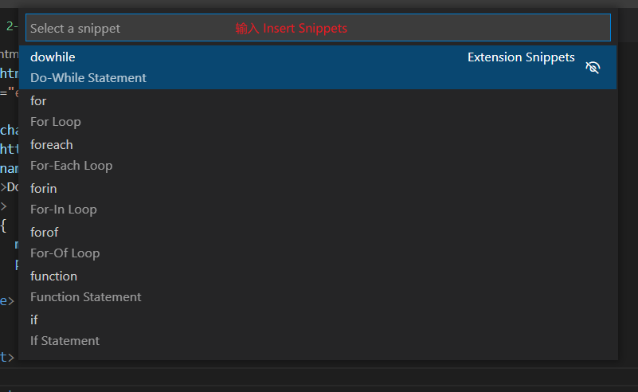
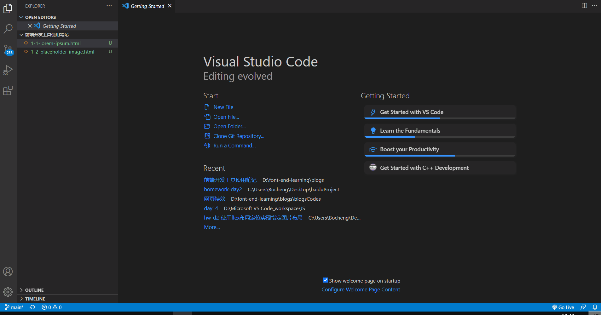
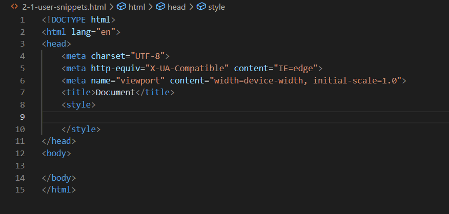
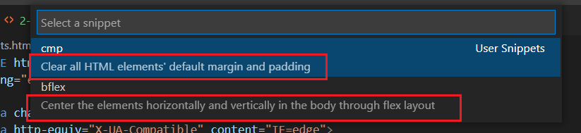
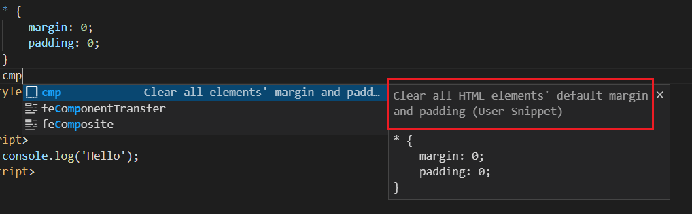
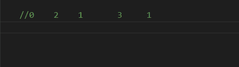
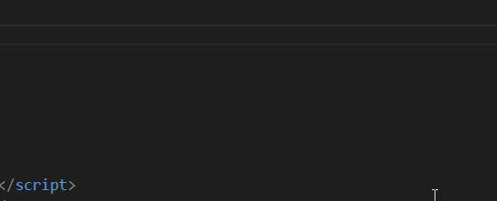

# VSCode中snippets（代码模板）的使用

有时在使用VSCode进行前端编码时总会有一些代码段是需要重复编写的，这时使用一些代码模板（snippets），通过规定的字符序列触发snippets，快速地输入一段预设的代码模板会使编码效率提高

## 内置Snippets

VSCode中本身也自带一些 snippets ，典型的就是JavaScript中的`for`


如果要查看内置的代码模板有哪些，可以通过`Command Palette`查看：

点击左下角的齿轮图案，然后找到`Command Palette`选项（或者使用快捷键`Ctrl + Shift + P`），在VSCode窗口上方出现的搜索框输入`Insert Snippets`即可查看到

要通过`Insert Snippets`命令查看一个语言的 snippets 时，**必须满足当前编辑的语言为snippet对应的语言的条件**，才能找到对应语言的 snippets 。比如如果要找到 JavaScript 的 snippets ，当前打开的文件是`.html`类型的，那么如果当前编辑位置为`<script>`内部，输入`Insert Snippets`就可以找到 JavaScript 的snippet；或者当前编辑的文件是`.js`，输入`Insert Snippets`也可以找到 JavaScript 的 snippets 。这是因为**snippets是有作用范围的**（**snippet scope**），snippet的作用范围要么是某个（些）语言，要么是某个（些）项目，这个不在这里做赘述，详细信息可见[这里](https://code.visualstudio.com/docs/editor/userdefinedsnippets#_snippet-scope)



这些配置文件所在目录为：
`<VSCode安装目录>\resources\app\extensions\<对应语言名称>\snippets\`

## 下载Snippets

这里的下载是指下载带有 snippets 的插件，可以在VSCode的插件市场搜索`@category:"snippets"`

## 自定义Snippets

这里以CSS代码为例：在进行简单的前端页面布局前，一般会将标签元素自带的内外边距统一清除，所以以下代码块是很经常用到的

```css
* {
    margin: 0;
    padding: 0;
}
```

为此我想为它配置一个 snippet ，这里需要找到 CSS snippet 的配置文件：找到VSCode左下角的齿轮图标，查找菜单中的“User Snippets”选项，选择 CSS （或者顶部菜单File > Prenferences > User Snippets）



打开了一个`css.json`文件后，可以看到有一大段注释，**认真读懂注释并按照规定输入**就可以配置出自己的代码模板了，先不说规则细节，先实现一下上述提到的清除内外边距的CSS样式

按照注释提示，添加以下内容并保存

```json
"Clear all elements' margin and padding": {
    "prefix": "cmp",
    "body": [
        "* {",
        "\tmargin: 0;",
        "\tpadding: 0;$0",
        "}"
    ],
    "description": "Clear all HTML elements' default margin and padding"
}
```

`prefix`表示触发代码段的文本，所以需要通过输入`cmp`触发，效果如下



### snippets 配置规则

当打开用户snippets的配置文件时，总能看到一段注释，根据这段注释一般就可以写出自己的 snippet 了，接下来基于这段注释的内容展示如何写一个 snippet（更多配置方式可以参考[这里](https://code.visualstudio.com/docs/editor/userdefinedsnippets)）

```json
// Place your snippets for css here. Each snippet is defined under a snippet name and has a prefix, body and 
// description. The prefix is what is used to trigger the snippet and the body will be expanded and inserted. Possible variables are:
// \$1, \$2 for tab stops, \$0 for the final cursor position, and \${1:label}, \${2:another} for placeholders. Placeholders with the 
// same ids are connected.
// Example:
// "Print to console": {
// "prefix": "log",
// "body": [
//   "console.log('\$1');",
//   "\$2"
// ],
// "description": "Log output to console"
// }
```

#### 配置文件类型

snippet 的配置文件是 JSON 文件，允许使用C语言风格的注释，允许定义不限定数量的 snippet

#### 基本结构

单个snippet的配置基本结构如下：

```json
// 尖括号包含内容表示自定义内容
"<snippet name>": {
    "prefix": "<triggerText>",
    // 如果模板有多行，应该用字符串数组赋值，一个元素代表一行内容
    "body": "<template>",
    "description": "<description of this snippet>"
}
```

*多个配置之间用逗号分隔*（不能有多余逗号）

首先一个 snippet 配置要指定该一个名称，然后给这个项赋值一个对象
对象中包含三个部分：`prefix`、`body`、`description`

- `prefix`是指定**用于触发snippet的文本**，比如上述配置的清除元素内外边距的 snippet ，使用的`prefix`是`cmp`（clear margin and padding）。这个可以根据自己的喜好配置，主要是要好记，毕竟配置snippet就是为了提高编码效率

- `body`是指定代码模板内容，这里可以赋值为**单个字符串**或者**一个字符串数组**。
  **当模板只有一行内容或者只有一行代码时，可以直接把这行代码作为字符串赋值给`body`**。比如如果想要快速打印`console.log("hello")`这一句，则可以配置：

  ```json
  "Print Hello to console": {
      "prefix": "hello",
      "body": "console.log('Hello');", // 直接赋值语句字符串
      "description": "Print Hello to console"
  }
  ```

  **如果模板是多行内容，那么则需要用一个字符串数组来赋值**（如上述CSS的例子），其中一个元素代表一行内容。*其中的空白字符可以使用转义字符（如上述CSS的例子），并且如果直接应用空白字符，只有空格可以应用（不可以直接应用制表符）*

- `description`是指定描述该snippet的作用或者模板内容的字段，它的内容会出现在相关的提醒中

  

  

#### 特殊结构的使用

`body`部分的内容可以使用一些特殊结构来控制光标位置和插入的文本。以下介绍一下配置文件中默认注释提到的**tabstops**和**placeholders**

##### tabstops

当输出一个 snippet 时，如果 snippet 的`body`定义了tabstops，那么可以**通过`Tab`键来使光标位置跳到特定位置**，方便修改生成的模板

**tabstops用`$0, $1, $2, ......`标识，数字表示被访问的顺序，而`$0`标识的是最后到达的光标位置**，并且**相同数字的tabstops是相关联的**（也就是说会有多个光标同时在多个相关联的位置）

看下述例子：

```json
// 添加到JavaScript的snippets配置文件中
"Test tabstops": {
    "prefix": "tts",
    "body": "$0two($2);one($1);three($3);one($1)",
    "description": "a test for tabstops"
}
```

以上这个例子刚开始时会有两个光标分别在两个`one()`的括号内；然后按一次`Tab`后，会有一个光标在`two()`括号内；第二次按`Tab`后，光标会在`three()`括号内；再按一次`Tab`，光标会跑到这行代码最前面，因为`$0`标识光标最后到达的位置（这里如果不设定`$0`会默认到达`body`内容的最后的位置，在这里就是生成的那行代码的末尾）



至此应该就可以理解`tabstops`这个称呼的含义了，其实就是“**按tab后光标停止的地方**”
另外可以**按`Shift+Tab`退回上一个tabstops的位置**，但要注意的是如果到达了`$0`，也就是snippet中光标的最后位置后还进行了其他操作（包括按`Tab`），就无法回退到上一个tabstops的位置了

##### placeholders

**placeholders就是带值的tabstops**，其中的值会作为默认文本插入代码并被选中，这样就可以方便地在需要时修改代码模板的默认内容了

最典型的例子就是文章开头内置的那个`for`循环JS snippet，这里我稍微复现一下来举个例子

```json
"Test placeholders": {
    "prefix": "flt",
    "body": [
        "for(let ${1:index} = 0; ${1:index} < ${2:array}.length; ${1:index} ++) {",
        "\t${4:const} ${3:element} = ${2:array}[${1:index}];",
        "\t$0",
        "}"
    ],
    "description": "a test for placeholders using for loop"
}
```

刚开始时，有多个选中的`index`，此时可以同时修改全部`index`为想要的内容；接着按一次`tab`，同时选中所有的`array`，这时也可以同时修改所有选中内容；按第二次`tab`就选中了`element`；按第三次，就到达了`const`；再按一次就到了最后的位置`$0`（这里如果不设定`$0`会默认到达`body`内容的最后的位置，在这里就是右花括号的后面）



snippet语法允许使用的特殊结构不止以上的tabstops和palceholders的配置，还有其他的，详情参考[这里](https://code.visualstudio.com/docs/editor/userdefinedsnippets#_snippet-syntax)

参考：
> <https://code.visualstudio.com/docs/editor/userdefinedsnippets>
