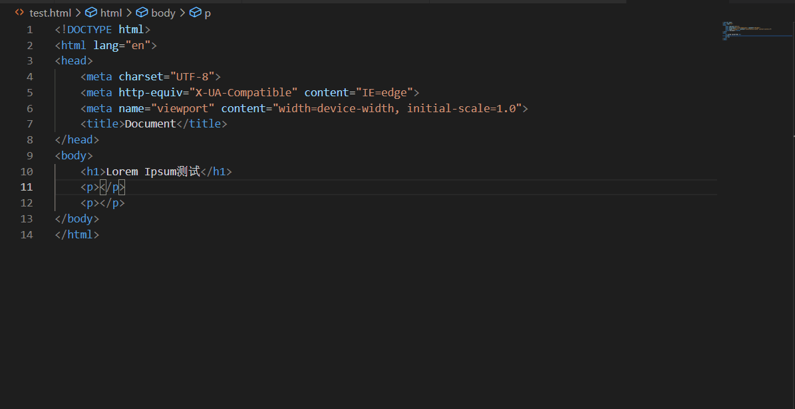
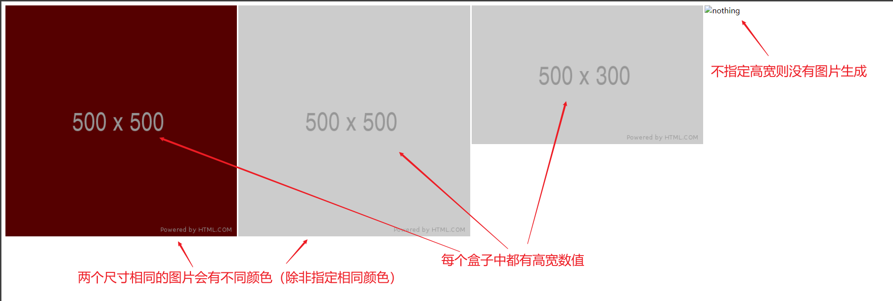
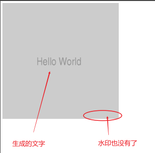
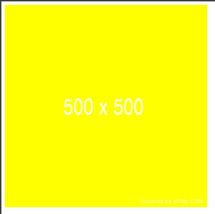

# 生成填充文字和图片

前端设计中有一个常见的单词叫`placeholder`，这个词往往表示其对应内容是当前页面中的临时填充内容。在前端页面的设计中，有时为了更好地看出布局效果，需要往页面一些地方填充文字或图片，这时能自动生成的**填充文字**（placeholder text）和自定义大小的**填充图片**（placeholder image）就派上用场了

## 生成填充文字

这里我是利用 Visual Studio Code 内置的 Emmet 语法来生成填充文字（一些主流的前端常用的编辑器都一般内嵌有填充文字的功能或者支持一些填充文字的插件）

**需要输入的 emmet 指令是`lorem`**。指令生效后会生成一段乱码形式的拉丁文字，称之为**填充文字**，placeholder text

通过此可以在进行前端页面设计时往需要填入文字的地方填入一些字段，方便设计出合理的布局效果。比如你在设计一个留言板，希望填入一些文字看看效果，此时就可以利用这些填充文字了。另外，一些开发人员在设计字体时，为了验证效果，也会使用这些填充文字

使用`lorem`指令的生成的文字填充叫`Lorem Ipsum`，实际上还有其他的 placeholder text ，想要了解更多信息可以通过以下链接了解：

> <https://placeholder.com/text/lorem-ipsum/>  
> <https://placeholder.com/text/>



## 生成填充图片

这里，我介绍的生成填充图片的方式是**利用一个特殊的链接生成填充图片**：
> <https://via.placeholder.com>  
> 或者\
> <http://via.placeholder.com>

**这个链接可以通过改变 URL 的路径（`path`）来生成指定大小、指定文字颜色以及指定背景颜色的填充图片，并且还可以通过修改询问字符串（`query`）指定文字内容**

### 指定生成图片的大小

在`https://via.placeholder.com`的基础上添加图片的宽度或高度参数，可以生成指定大小的图片（单位为`px`）

比如现在要生成一个`500x500`的图片，可以使用一下任意一条URL：

```text
https://via.placeholder.com/500
https://via.placeholder.com/500x500
```

这需要说明一下：

- 当所需图片的高宽相等时，可以省略高，**只附上宽度值，这时默认高度和宽度相等**
- 当高宽不等时，需要显式写出高宽，并且**宽在前、高在后，用字母`x`连接起来（大小写都可以）**。比如`500x300`的图片则需要写成`https://via.placeholder.com/500x300`
- **生成的图片正中间默认有尺寸高宽数值**。比如上述的`https://via.placeholder.com/500`，生成的图片中间有“500x500”的字样。图片中的文字可以自行指定（见下文）
- 当两个相同尺寸的填充图片如果没有指定背景颜色，会自动产生不同的背景颜色（制定颜色见下文）
- 在使用时如果**不指定高宽那么将无法生成图片**

#### 如何使用

一般都是直接在需要填充的地方放入一个图片标签``，其中的`src`的值就是填充图片的URL

```html
<div style="width: 500px; height: 500px">
    
</div>
<div style="width: 500px; height: 500px">
    
</div>
<div style="width: 500px; height: 300px">
    
</div>
<div>
    
</div>
```



### 指定文字内容

通过**修改URL中的询问字符串（query string）`?text`来指定自定义的文字内容**。用法如下：

```text
https://via.palceholder.com/500?text=Hello+World
```

生成的图片如下



指定的内容为`Hello+World`，其中的`+`表示空格

### 指定生成图片的文字颜色和背景颜色

通过修改URL的path来指定文字颜色和背景颜色，颜色值取十六进制数值（不需要加前缀`0x`）。不指定的话默认背景是灰色，文字是黑色（严格来说只是深灰色），但有时候也不一定是这个颜色（我也不知道为什么）

这里要注意**背景颜色的值在前，文字颜色值在后**，并且**颜色的指定一定要在高宽之后**，否则无法生成图片

```html
<div style="width: 500px; height: 500px">
    
</div>
```



### 指定生成图片格式

上述的例子都没有指定图片格式，默认为`.gif`。该链接支持的图片格式有`.png`、`.gif`、`.jpg`、`.jpeg`、`.webp`

格式可以指定在URL任何选项的末尾，但不能在询问字符串后面，如果在询问字符串后面则只是生成文字，并不指定的图片格式

```text
https://via.placeholder.com/500.png
https://via.placeholder.com/500x300.png
https://via.placeholder.com/500x300.png?text=hello+world
https://via.placeholder.com/500/fff.png
https://via.placeholder.com/500/fff.png/ff0
https://via.placeholder.com/500/fff/ff0.png
```

综合上述所述，完整的参数添加顺序为：

```text
https://via.placeholder.com/<width>x<height>/<bgColor>/<txtColor><.ext>?text=<some+text>

除了 <width> ，其他都可以省略
<.ext>表示图片后缀（格式），只要不在 ?text 之后就可以
<txtColor>必须在<bgColor>之后，也就是说<txtColor>不能单独存在
```

另外想了解更多信息可以到官网查看：<https://placeholder.com>

## 只生成治愈猫咪填充图片

这里附上一个只生成治愈猫咪图片的填充图片生成链接：<https://placekitten.com/>

可以通过改变`path`指定图片大小，但规则和上述有所不同：

这里的高宽信息也必须指定，高可以省略，此时默认为正方形。但是具体指定高宽时，宽和高的值**并不使用`x`分隔，而是使用`/`分隔**：

```bash
https://placekitten.com/500/300   # 这是正确的
https://placekitten.com/500       # 这也是正确的，此时为正方形图片
https://placekitten.com/500x500   # 这是错误的
```

这个填充图片**只能指定大小，不能指定颜色、文字内容**（因为生成的图片是随机的猫咪图片，不能指定图片内容）

下面展示一张我从此链接随机获得的一张图片：


文件源码：<>

参考：
><https://placeholder.com>
><https://placeholder/text.com>
><https://placeholder.com/text/lorem-ipsum/>
><https://placekitten.com>
