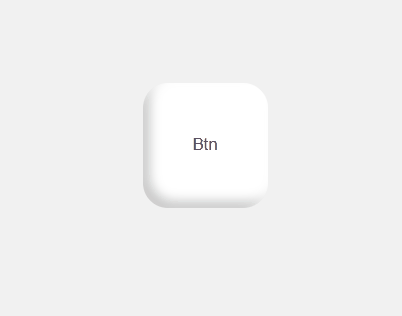

# 利用box-shadow实现一个立体的按钮

改变按钮`button`的默认样式，创建一个立体的按钮



这个效果是通过`box-shadow`实现

这里要注意`box-shadow`是允许对同一个元素设置多个阴影的，需要用逗号分隔；**多个阴影的层叠顺序是：写在前面的阴影将覆盖在后写的阴影上面**

主要代码：

```html
<button>Btn</button>
```

```css
button {
  /* 关键是使用这个 盒子阴影 的样式 */
  box-shadow: -6px 6px 8px inset rgba(255, 255, 255, 0.6),
    6px -6px 8px inset rgba(0, 0, 0, 0.2);
}

/* 按钮被点击时将阴影切换 */
button:active {
  box-shadow: -6px 6px 8px inset rgba(0, 0, 0, 0.2),
    6px -6px 8px inset rgba(255, 255, 255, 0.6);
}
```

## 演示链接

CodePen演示链接：<https://codepen.io/Zhao-Bocheng/pen/zYwrPEL>

文章源码：<>

参考：
><https://www.bilibili.com/video/BV1w64y1b7eF>
