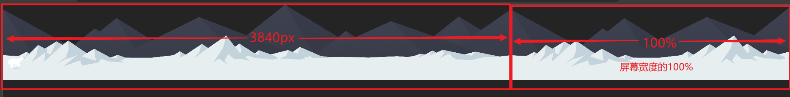
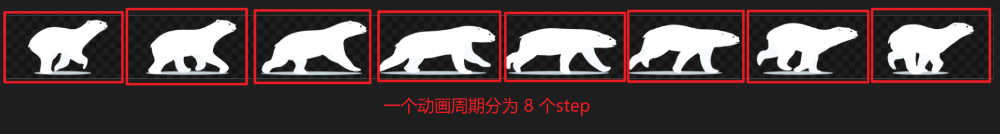

# 小熊跑跑

通过CSS的动画属性`animation`和at-rule关键帧`@keyframe`实现一个小熊在雪山奔跑的效果（*图片素材及源码见文末链接*）

1、雪山动画的实现：  
将素材图片作为**背景图**应用到“雪山”盒子里（.bg1 和 .bg2）  
动画实现有 **两种** 方式：  

a. 移动**整个“雪山”盒子**（盒子是绝对定位的，left的值从 0 变化到 -3840px）  
注意：这里两个盒子的宽度都比背景图的宽度宽 一个屏幕宽度（3840px + 100%），这是为了动画循环播放时衔接顺畅

​b. 移动**背景图片**     
注意：背景图片要设置为在水平方向重复，即 "repeat-x"，此时雪山盒子宽度至少和屏幕宽度一样即可

2、小熊动画的实现：  

将素材图片作为背景图应用到“小熊”盒子里（.bear）

小熊动画包括**两部分**：  

a. 小熊一直要保持的连贯奔跑效果  

b. 小熊在开场时跑到中间  

a部分的动画要通过**移动背景图片**来实现，这里使用的**动画定时函数为 steps(8)** ，动画重复次数为 无限次

关于`steps()`的使用可以参考我的另一篇[文章](https://blog.csdn.net/angry_rooster/article/details/122902546)

​b部分的动画要通过**移动整个盒子**来实现，并且在盒子移动到中间位置时就保持住最后的状态不再移动（将 fill-mode 设置为 forwards）

## 代码运行效果

文章源码：<https://gitee.com/thisismyaddress/bocheng-blogs/tree/master/%E7%BD%91%E9%A1%B5%E7%89%B9%E6%95%88/%E5%B0%8F%E7%86%8A%E8%B7%91%E8%B7%91>
