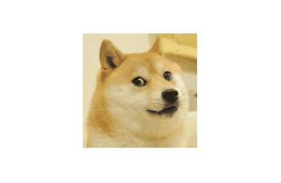
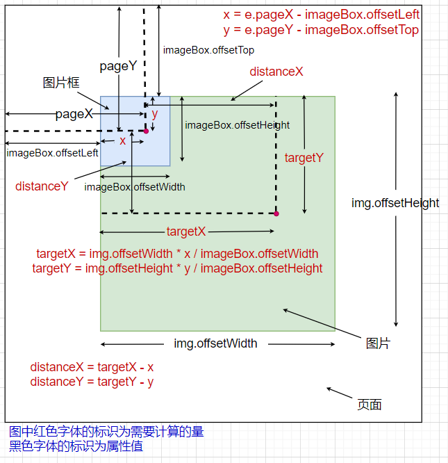
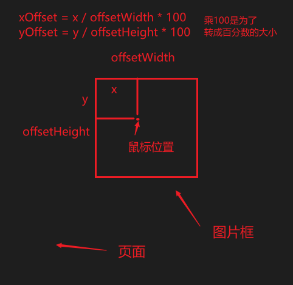
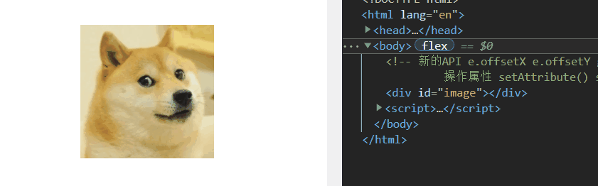
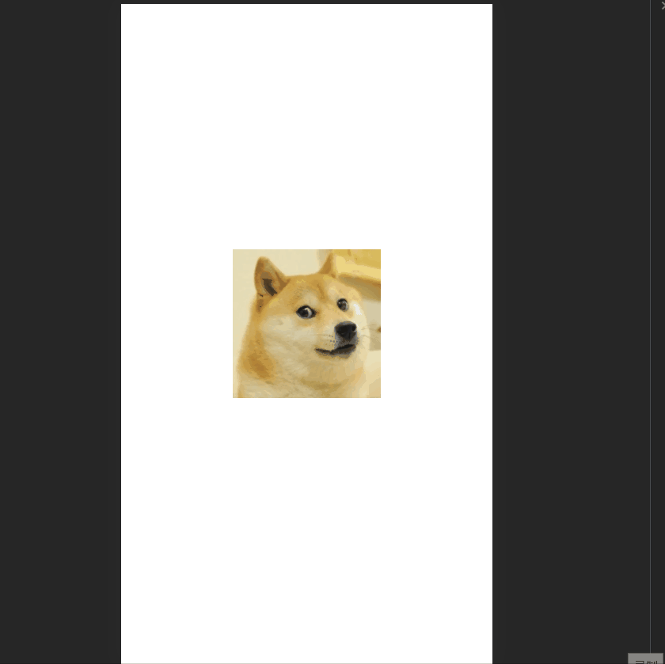
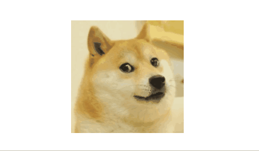
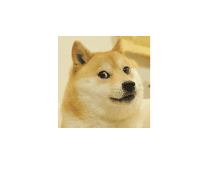

# 放大镜效果

这里的放大镜效果是指当鼠标（手指）和页面（屏幕）中一个方框内的图片交互时，图片呈现放大效果，图片在框内显示的放大区域随鼠标（页面）位置的改变而改变



**演示链接：**<https://codesandbox.io/s/fangdajingxiaoguo-jxdfo>

以下我尝试了几种不同的实现方式

## 移动图片框内的图片

这里是通过改变**图片框内的一张图片的大小和绝对定位偏移量**实现最终效果

HTML的基本结构如下：

```html
<div id="image">
    <!-- 该图片设置为绝对定位 -->
    
</div>
```

这里JS中**涉及到的事件有`mouseenter`，`mouseleave`，`mousemove`**，这些事件都在图片框绑定（`#image`）

在`mouseenter`事件处理函数中，只需要**将框中的图片尺寸放大**即可：

```js
let imageBox = document.getElementById('image');

imageBox.addEventListener('mouseenter', () => {
    // 这里将图片（图片和框一样为正方形）放大为 450x450 ，相当于图片框的3倍（150x150）
    img.style.width = '450px';
})
```

在`mouseleave`事件处理函数中则只需要**将定位的偏移样式和图片的放大尺寸样式清除**即可：

```js
// 清除所有样式 >> 恢复原样
imageBox.addEventListener('mouseleave', () => {
    img.style.width = '';
    img.style.top = '';
    img.style.left = '';
})
```

图片的放大效果的实现重点是`mousemove`的事件处理函数中关于**图片定位偏移量的计算**，这里的思路如下：

先找出当前鼠标位置相对于图片框左上角的坐标位置`x, y`，接着计算出这个坐标位置在图片框中的相对百分比位置（比如该点在框的正中间的话就是`0.5, 0.5`或者`50%, 50%`，这个百分比是相对于框体的左上角而言的），用这个百分比位置在放大的图片中找到相对于放大的图片左上角相同百分比偏移的位置`targetX, targetY`，然后**将`x, y`和`targetX, targetY`这两个点通过定位偏移重叠**即可。为了将这两个点重叠，要求出这两个点的水平距离和垂直距离`distanceX, distanceY`，由于需要将图片相对于图片框的进行绝对定位偏移，那么就需要进行反向偏移，则需要对求出的`distanceX, distanceY`取负值，也就是最终的定位偏移为`left: - distanceX + 'px'; top: - distanceY + 'px'`

以下为具体计算步骤：

- 计算当前鼠标位置相对于图片框左上角的坐标`x, y`：

  鼠标在页面中的具体位置可以通过`e.pageX, e.pageY`获得（`e`表示鼠标事件对象），这个具体位置是相对于页面的左上角计算的，那么相对于框体的左上角位置，可以通过减去框体的顶边和左边距离页面的顶边和左边的距离（也就是`imageBox.offsetTop, imageBox.offsetLeft`）获得：

  ```text
  x = e.pageX - imageBox.offsetLeft;
  y = e.pageY - imageBox.offsetTop;
  ```

- 将坐标转化成在图片框中的相对百分比位置：

  相对于整个框体的相对位置的计算需要使用到框体的高度和宽度（`imageBox.offsetWidth, imageBox.offsetHeight`）

  ```text
  x / imageBox.offsetWidth；
  y / imageBox.offsetHeight;
  ```

- 计算放大的图片中相同相对位置下的目标点`targetX, targetY`:

  这需要利用到上述计算得到的相对位置，再去乘以放大的图片尺寸（`img.offsetWidth, img.offsetHeight`）获得

  ```text
  targetX = img.offsetWidth * (x / imageBox.offsetWidth);
  targetY = img.offsetHeight * (y / imageBox.offsetHeight);
  ```

- 计算需要进行偏移的距离`distanceX, distanceY`:

  偏移的水平距离和垂直距离就是上述两个相对位置`x, y`和`targetX, targetY`的水平距离和垂直距离的差值：

  ```text
  distanceX = targetX - x;
  distanceY = targetY - y;
  ```

- 将图片相对于图片框进行绝对定位偏移，需要将图片反向移动，所以需要对偏移距离的值取负（设置样式要加上单位“px”）：

  ```text
  img.style.left = - distanceX + 'px';
  img.style.top = - distanceY + 'px';
  ```

至此对于图片定位偏移量的计算就结束了（具体计算可以参见下图解析）



所以最终的`mousemove`的事件处理函数为：

```js
imageBox.addEventListener('mousemove', (e) => {
    // 当前鼠标位置相对于图片框左上角的坐标x, y
    let x = e.pageX - imageBox.offsetLeft;
    let y = e.pageY - imageBox.offsetTop;
    // 放大的图片中相同相对位置下的目标点targetX, targetY
    let targetX = img.offsetWidth * x / imageBox.offsetWidth;
    let targetY = img.offsetHeight * y / imageBox.offsetHeight;
    // 需要进行偏移的距离distanceX, distanceY
    let distanceX = targetX - x;
    let distanceY = targetY - y;
    // 将图片相对于图片框进行绝对定位偏移，需要将图片反向移动，所以需要对偏移距离的值取负
    img.style.left = - distanceX + 'px';
    img.style.top = - distanceY + 'px';
})
```

## 移动图片框的背景图片

这里介绍第二种方式：将上述的图片框内的图片移除，直接将要放大的图片作为图片框的背景图片，通过**改变背景图片大小和背景图片位置**来实现最终效果

HTML的基本结构如下：

```html
<div id="image"></div>
```

这里涉及到的三个JS事件还是`mouseenter`，`mouseleave`，`mousemove`，这些事件都和图片框绑定（`imageBox`）

在`mouseenter`事件处理函数中，只需要将框的背景图片尺寸放大即可：

```js
image.addEventListener('mouseenter', (e) => {
    // 为了提高事件处理函数的通用性，最好就不要引用外部变量 image
    // image.style.backgroundSize = '450px';
    e.target.style.backgroundSize = '450px';
});
```

在`mouseleave`事件处理函数中则是只需要将背景图片的尺寸和位置样式清除即可：

```js
image.addEventListener('mouseleave', (e) => {
    // image.style.backgroundSize = '';
    // image.style.backgroundPosition = '';
    e.target.style.backgroundSize = '';
    e.target.style.backgroundPosition = '';
});
```

这里的实现重点依然是对图片偏移量的计算，不过不一样的是，这里的背景图片尺寸信息比较难找到相关属性值来动态获取（如`elem.offsetWidth`），不能像上述采用绝对定位的做法那样求出具体的偏移距离。而如果设为定值，那么当背景图片的放大尺寸变了，程序要改的地方就比较多了

这里利用背景图片位置的百分比取值来实现将图片移动到目标位置的目的（这样甚至都不用计算具体偏移距离了！）

这里简单讲一下背景图片位置`background-position`取值为百分数时的表现：

百分比取值执行的是下述公式，最终的结果是使容器和背景图片相同的相对位置重叠

```text
(container width - image width) * (position x%) = (x offset value)
(container height - image height) * (position y%) = (y offset value)
```

从上述公式可以看出当背景图片大小和容器大小相同时，使用百分比取值是不会有偏移的

其实百分比取值的表现说白了就是指定一个相对于图片左上角的一个相对位置，这个位置会和容器相对于左上角的相同的相对位置重叠，比如`background-position: 50% 50%`，这个点指定的是背景图片的正中心，那么此时该取值会使背景图片的正中心和容器的正中心重合

回归正题，此时采用背景图片位置的百分比取值，则只需要计算出当前鼠标位置相对于图片框左上角的坐标`x, y`在图片框中的相对百分比位置，就可以实现背景图片的正确偏移



```js
image.addEventListener('mousemove', (e) => {
    // let x = e.pageX - image.offsetLeft;
    // let y = e.pageY - image.offsetTop;
    // // 偏移百分比
    // let xOffset = x / image.offsetWidth * 100;
    // let yOffset = y / image.offsetHeight * 100;

    // image.style.backgroundPosition = xOffset + '% ' + yOffset + '%';

    // 计算出鼠标当前相对于图片框左上角的坐标
    let x = e.pageX - e.target.offsetLeft;
    let y = e.pageY - e.target.offsetTop;

    // 计算出相对位置
    // 乘 100 是为了转成百分数的大小
    let xOffset = x / e.target.offsetWidth * 100;
    let yOffset = y / e.target.offsetHeight * 100;

    e.target.style.backgroundPosition = xOffset + '% ' + yOffset + '%';
});
```

## 移动图片框的背景图片——使用尽可能多的CSS特性

这里主要是我看了[B站的一个视频教程](https://www.bilibili.com/video/BV12N411974Q)后的一个尝试，虽然其中的步骤略显繁杂，但其实现的过程让我学习到了新的知识

这里的实现使用了尽可能多的CSS特性，另外还尝试了未曾用过的API（`getBoundingClientRect()`，`e.offsetX`，`e.offsetY`）

这里依然使用移动背景图片的方式，涉及到的JS事件还是`mouseenter`，`mouseleave`，`mousemove`（都和图片框绑定）

在`mouseenter`中放大图片的操作不再是直接放大背景图片，而是**通过添加属性的方式间接实现**：

这里为图片框**设置一个`zoomed="1"`的属性**，来表示此时处于放大状态，这样的话需要配合 CSS 的属性选择器来改变背景图片尺寸：

```html
<div id="image"></div>
```

```css
#image[zoomed] {
    background-size: 450px auto;
}
```

```js
image.addEventListener('mouseenter', (e) => {
    e.target.setAttribute('zoomed', 1);
})
```

当鼠标离开时需要图片缩小，那么**只需要移除属性**即可：

```js
image.addEventListener('mouseleave', (e) => {
    e.target.removeAttribute('zoomed');
});
```



接下来在`mousemove`事件处理函数中还是通过改变背景图片位置的百分比取值实现图片位置的偏移，但这里不直接改变背景图片位置的样式，而是**通过改变两个CSS属性（`--x`和`--y`）来间接改变图片位置样式**。并且图片框尺寸是通过`getBoundingClientRect()`返回的一个对象的`width`和`height`属性获取。另外当前鼠标位置相对于框体左上角的坐标位置不再需要特地进行计算获得，而是直接使用`e.offsetX`和`e.offsetY`，这两个属性表示的就是相对于框体左上角计算的鼠标位置

```js
image.addEventListener('mousemove', moveHandler(e) {
    // 这里特地尝试使用了 getBoundingClientRect()
    // 这里不作解释，只要知道它可以方法返回元素的大小及其相对于视口的位置即可
    let rect = e.target.getBoundingClientRect();

    // 这里的 e.offsetX 和 e.offsetY 表示的是鼠标相对于框体左上角的位置，相当于上述特地计算的 x 和 y
    // rect.width 相当于 e.target.offsetWidth ，rect.height 相当于 e.target.offsetHeight
    let xOffset = e.offsetX / rect.width;
    let yOffset = e.offsetY / rect.height;

    // 通过改变两个CSS属性（--x和--y）来间接改变图片位置样式
    e.target.style.setProperty('--x', xOffset);
    e.target.style.setProperty('--y', yOffset);
});
```

上述事件处理函数中最后设置了两个 CSS 变量的值，这时应该使用起来，使其生效：

```css
#image[zoomed] {
    background-size: 450px auto;
    /* 将 --x 和 --y 通过 var() 解析出计算值并应用到背景图片位置样式中 */
    background-position: calc(var(--x) * 100%) calc(var(--y) * 100%);
}
```

## 尝试兼容移动端

上述的应用都是在PC端下的，是无法在移动端使用的，因为**移动端下并没有鼠标事件，所以上述的事件都不会触发**，自然的，放大镜的效果就无法实现了

在移动端下需要使用**触摸事件**来实现这个效果，这里**涉及到的触摸事件有`touchstart`，`touchend`，`touchmove`**，这些事件都和图片框绑定

在具体实现上的思路和上述一致：触摸开始（`touchstart`）时图片放大，触摸结束（`touchend`）时图片恢复原来大小并清除图片偏移样式，触摸点移动时（`touchmove`）需要计算图片的偏移。只是在具体实现上需要进行一些编码调整

这里采用移动背景图片的方式，以下是对上面的那个使用了尽可能多的 CSS 属性的做法进行移动端兼容（使用移动图片框内图片的方式大同小异，只是在计算偏移量方面的计算量会大一点）

`touchstart`和`touchend`的事件处理函数的内容可以和上述`mouseenter`和`mouseleave`的分别一样：

```js
image.addEventListener('touchstart', (e) => {
    e.target.setAttribute('zoomed', 1);
});

image.addEventListener('touchend', (e) => {
    e.target.removeAttribute('zoomed');
});
```

这里差异较大的地方在于`touchmove`的事件处理函数内容。

- 由于触发触摸事件的触摸点可能不止一个（多个手指触摸屏幕），所以这里在进行计算时**需要特别的指明一个触摸点，使用`e.touches[0]`而不是`e`指定一个触摸事件对象，避免出现混乱**，触摸事件源可以通过`e.touches[0].target`获得

- 由于**触摸事件对象并没有`e.offsetX`和`e.offsetY`这两个属性**，所以触摸点位置**相对于框体左上角的坐标依然需要特地进行计算**
  
  这里由于我想特地去尝试`getBoundingClientRect()`，在计算过程中为了获取框体的位置信息，需要使用该方法返回的对象的`top`和`left`属性获得，并且要注意：该方法返回的框体位置信息是**相对于视口而不是相对于页面**而言的，所以如果页面发生滚动时，使用相对于页面计算的触摸点位置属性`e.pageX`和`e.pageY`计算出的结果是不准确，这里应该**采用同样相对于视口计算的触摸点位置属性`e.clientX`和`e.clientY`**

  ```js
  // 使用相对于视口计算的触摸点位置 clientX 和 clientY
  // rect = e.target.getBoundingClientRect()
  x = e.touches[0].clientX - rect.left;
  y = e.touches[0].clientY - rect.top;
  
  // 如果要使用相对于页面计算的触摸点位置 pageX 和 pageY，则需要采用同样相对于页面计算的框体位置信息 offsetLeft 和 offsetTop
  x = e.touches[0].pageX - e.touches[0].target.offsetLeft;
  y = e.touches[0].pageY - e.touches[0].target.offsetTop;
  ```

  这样就可以计算出相对位置的信息了：

  ```js
  // rect = e.target.getBoundingClientRect()
  xOffset = x / rect.width;
  yOffset = y / rect.height;
  
  // 如果使用相对于页面计算的触摸点位置，则需要这样计算相对位置
  // xOffset = x / e.touches[0].target.offsetWidth;
  // yOffset = y / e.touches[0].target.offsetHeight;
  ```

由于在**对屏幕进行触摸移动时，默认会拖动页面**，为了避免这种情况，需要使用`e.preventDefault()`；

另外由于一个触摸点长时间接触屏幕而不移动时，会触发页面菜单，需要通过`contextmenu`事件来**禁止长按触发菜单**



```html
<div id="image"></div>
```

``` js
// 禁止长按菜单
document.addEventListener('contextmenu', (e) => {
    e.preventDefault();
})
```

```js
image.addEventListener('touchmove', (e) => {
    // 防止页面被拖动
    e.preventDefault();

    let rect = e.target.getBoundingClientRect();

    // 由于 touch 事件没有 offsetX 和 offsetY 属性，所以需要进行额外的计算操作
    // 可能有多个触摸点，这里只取一个触摸点来计算触摸的位置 e.touches[0]
    // 使用相对于视口计算的触摸点位置 clientX 和 clientY（方法返回的框体位置信息是相对于视口而言的）
    // rect = e.target.getBoundingClientRect()
    let x = e.touches[0].clientX - rect.left;
    let y = e.touches[0].clientY - rect.top;

    // 如果要使用相对于页面计算的触摸点位置 pageX 和 pageY，则需要采用同样相对于页面计算的框体位置信息 offsetLeft 和 offsetTop
    // let x = e.touches[0].pageX - e.touches[0].target.offsetLeft;
    // let y = e.touches[0].pageY - e.touches[0].target.offsetTop;

    let xOffset = x / rect.width;
    let yOffset = y / rect.height;

    // 如果使用相对于页面计算的触摸点位置，则需要这样计算相对位置
    // let xOffset = x / e.touches[0].target.offsetWidth;
    // let yOffset = y / e.touches[0].target.offsetHeight;

    e.target.style.setProperty('--x', xOffset);
    e.target.style.setProperty('--y', yOffset);
});
```

此时有个问题就是当触摸点触摸屏幕但不移动时，图片显示的放大区域可能是不正确的（如下，即使触摸的位置是其他位置，也总是显示图片左上角的那只耳朵）



这是因为此时触摸点不移动，就不会触发`touchmove`事件，导致无法对图片进行移动，所以这里需要在`touchstart`事件处理函数中添加相关步骤来初始移动图片

```js
// 这里将触摸移动事件处理函数体抽离为一个独立的函数
image.addEventListener('touchstart', (e) => {
    e.target.setAttribute('zoomed', 1);
    // 避免重新触摸后触摸点未移动时图片位置不正确
    moveHandler(e);
});

image.addEventListener('touchmove', moveHandler);

function moveHandler(e) {
    // 防止页面被拖动
    e.preventDefault();

    let rect = e.target.getBoundingClientRect();

    // 由于 touch 事件没有 offsetX 和 offsetY 属性，所以需要进行额外的计算操作
    // 可能有多个触摸点，这里只取一个触摸点来计算触摸的位置 e.touches[0]
    // 使用相对于视口计算的触摸点位置 clientX 和 clientY（方法返回的框体位置信息是相对于视口而言的）
    // rect = e.target.getBoundingClientRect()
    let x = e.touches[0].clientX - rect.left;
    let y = e.touches[0].clientY - rect.top;

    // 如果要使用相对于页面计算的触摸点位置 pageX 和 pageY，则需要采用同样相对于页面计算的框体位置信息 offsetLeft 和 offsetTop
    // let x = e.touches[0].pageX - e.touches[0].target.offsetLeft;
    // let y = e.touches[0].pageY - e.touches[0].target.offsetTop;

    let xOffset = x / rect.width;
    let yOffset = y / rect.height;

    // let xOffset = x / e.touches[0].target.offsetWidth;
    // let yOffset = y / e.touches[0].target.offsetHeight;

    e.target.style.setProperty('--x', xOffset);
    e.target.style.setProperty('--y', yOffset);
}
```

修改后效果如下（现在触摸哪里，放大的位置就是哪里）


现在还有一个问题就是当触摸点在图片框内移动到框外区域时，`touchmove`事件还是处于被触发的状态，此时触摸点的位置在框外，而对于图片偏移量的计算依然根据触摸点位置计算，那么此时就会导致图片被移动到可见区域外


为解决这个问题需要限制图片可偏移的范围，只需要做些简单判断即可

```js
function moveHandler(e) {
    // ......
    
    // 使用相对于视口计算的触摸点位置 clientX 和 clientY（方法返回的框体位置信息是相对于视口而言的）
    // rect = e.target.getBoundingClientRect()
    let x = e.touches[0].clientX - rect.left;
    let y = e.touches[0].clientY - rect.top;
    // 限制范围
    x = x < 0 ? 0 : x;
    x = x > rect.width ? rect.width : x;
    y = y < 0 ? 0 : y;
    y = y > rect.height ? rect.height : y;

    // 如果要使用相对于页面计算的触摸点位置 pageX 和 pageY，则需要采用同样相对于页面计算的框体位置信息 offsetLeft 和 offsetTop
    // let x = e.touches[0].pageX - e.touches[0].target.offsetLeft;
    // let y = e.touches[0].pageY - e.touches[0].target.offsetTop;
    // 限制范围
    // x = x < 0 ? 0 : x;
    // x = x > e.touches[0].target.offsetWidth ? e.touches[0].target.offsetWidth : x;
    // y = y < 0 ? 0 : y;
    // y = y > e.touches[0].target.offsetHeight ? e.touches[0].target.offsetHeight : y;

    // ......
}
```

为了让代码看起来NB一点，可以将上述的判断语句合并一下：

```js
function moveHandler(e) {
    // ......
    
    // 限制范围
    x = Math.min(Math.max(0, x), rect.width);
    y = Math.min(Math.max(0, y), rect.height);
    // x = x < 0 ? 0 : x;
    // x = x > rect.width ? rect.width : x;
    // y = y < 0 ? 0 : y;
    // y = y > rect.height ? rect.height : y;

    // ......
    // 限制范围
    // x = Math.min(Math.max(0, x), e.touches[0].target.offsetWidth);
    // y = Math.min(Math.max(0, y), e.touches[0].target.offsetHeight);
    // x = x < 0 ? 0 : x;
    // x = x > e.touches[0].target.offsetWidth ? e.touches[0].target.offsetWidth : x;
    // y = y < 0 ? 0 : y;
    // y = y > e.touches[0].target.offsetHeight ? e.touches[0].target.offsetHeight : y;

    // ......
}
```

至此，触摸点即使移动出了图片框外也可以正确显示放大的图片了



至此移动端的放大镜效果实现就完成了，现在需要将移动端的相关代码和PC端的相关代码合并达成兼容的目的

为了方便为鼠标事件和触摸事件赋予事件处理函数，同时使代码结构看起来优雅一点，这里我将事件处理函数的代码进行抽离。由于`mouseenter`与`mouseleave`的事件处理函数分别和`touchstart`与`touchend`的内容几乎一致，所以这四个事件的处理函数并不需要做太多的差异编码。这里有一个禁止长按菜单的操作（`contextMenu`事件）是只需要在移动端内设置的，所以需要判断此时触发的事件是移动端事件还是PC端的，以此来决定是否要禁止长按触发菜单

```js
image.addEventListener('mouseenter', enterHandler);
image.addEventListener('mouseleave', leaveHandler);

image.addEventListener('touchstart', enterHandler);
image.addEventListener('touchend', leaveHandler);

// 这里需要特地抽离出一个 contextmenu 事件处理函数，因为 removeEventListener 无法移除一个为匿名函数的监听器
function prevent(e) {
    e.preventDefault();
}

function enterHandler(e) {
    e.target.setAttribute('zoomed', 1);
    // 避免重新触摸后未移动时图片位置不正确
    moveHandler(e);

    if (e.type === 'touchend') {
        // 禁止长按菜单
        document.addEventListener('contextmenu', prevent)
    } else {
        // 取消禁止长按菜单
        document.removeEventListener('contextmenu', prevent);
    }
}

function leaveHandler(e) {
    e.target.removeAttribute('zoomed');
}
```

但`mousemove`和`touchmove`事件的事件处理函数内容差异较大，需要进行的差异编码比较多，其中重要的一个就是对事件类型的判断（详见以下代码）

```js
image.addEventListener('mousemove', moveHandler);
image.addEventListener('touchmove', moveHandler);

function moveHandler(e) {
    let rect = e.target.getBoundingClientRect();

    // 由于 touch 事件没有 offsetX 和 offsetY 属性，所以需要进行额外的计算操作
    let x = 0;
    let y = 0;

    // 对事件类型的判断
    if (['touchstart', 'touchend', 'touchmove'].includes(e.type)) {
        // 防止页面被拖动
        e.preventDefault();
        
        // 可能有多个触摸点，这里只取一个触摸点来计算触摸的位置 e.touches[0]
        // 使用相对于视口计算的触摸点位置 clientX 和 clientY（方法返回的框体位置信息是相对于视口而言的）
        // rect = e.target.getBoundingClientRect()
        x = e.touches[0].clientX - rect.left;
        y = e.touches[0].clientY - rect.top;
        // 限制范围
        x = Math.min(Math.max(0, x), rect.width);
        y = Math.min(Math.max(0, y), rect.height);
        // x = x < 0 ? 0 : x;
        // x = x > rect.width ? rect.width : x;
        // y = y < 0 ? 0 : y;
        // y = y > rect.height ? rect.height : y;
    } else {
        x = e.offsetX;
        y = e.offsetY;
    }

    let xOffset = x / rect.width;
    let yOffset = y / rect.height;

    e.target.style.setProperty('--x', xOffset);
    e.target.style.setProperty('--y', yOffset);
}
```

至此这个兼容就完成了

### 精简代码

可以看到，在我尝试使用`getBoundingClientRect()`以及`e.offsetX, e.offsetY`时，兼容PC端和移动端时，代码量有点多，实际上可以改变为统一做法，精简代码

```js
image.addEventListener('mousemove', moveHandler);
image.addEventListener('touchmove', moveHandler);s

function moveHandler(e) {
    let eventObj = null;

    if (['touchstart', 'touchend', 'touchmove'].includes(e.type)) {
        // 防止页面被拖动
        e.preventDefault();

        // 可能有多个触摸点，这里只取一个触摸点来计算触摸的位置 e.touches[0]
        eventObj = e.touches[0];
    } else {
        eventObj = e;
    }

    let x = eventObj.pageX - eventObj.target.offsetLeft;
    let y = eventObj.pageY - eventObj.target.offsetTop;

    // 限制范围
    x = Math.min(Math.max(0, x), eventObj.target.offsetWidth);
    y = Math.min(Math.max(0, y), eventObj.target.offsetHeight);

    let xOffset = x / eventObj.target.offsetWidth;
    let yOffset = y / eventObj.target.offsetHeight;

    e.target.style.setProperty('--x', xOffset);
    e.target.style.setProperty('--y', yOffset);
}
```

## 总结

放大镜效果涉及到的事件在PC端是`mouseenter`，`mouseleave`，`mousemove`，在移动端是`touchstart`，`touchend`，`touchmove`

实现的方式有不止一种，但总的来说就**三个步骤**：进入图片框时放大图片；离开图片框时恢复图片大小并将图片偏移样式清除；在图片框内移动鼠标或手指时图片的移动随鼠标或接触点的位置进行变化，要保证可视区域显示的图片放大位置为 鼠标或接触点在图片框相对位置 和 放大的图片相同相对位置 重叠时的图片部分

文章源码链接：<https://gitee.com/thisismyaddress/bocheng-blogs/tree/master/%E7%BD%91%E9%A1%B5%E7%89%B9%E6%95%88/%E6%94%BE%E5%A4%A7%E9%95%9C%E6%95%88%E6%9E%9C/%E5%A4%9A%E7%A7%8D%E5%AE%9E%E7%8E%B0%E6%96%B9%E5%BC%8F>

参考：
><https://www.bilibili.com/video/BV12N411974Q>
><https://developer.mozilla.org/zh-CN/docs/Web/API/Element/getBoundingClientRect>
><https://developer.mozilla.org/zh-CN/docs/Web/API/MouseEvent/offsetX>
><https://developer.mozilla.org/zh-CN/docs/Web/API/MouseEvent/offsetY>
