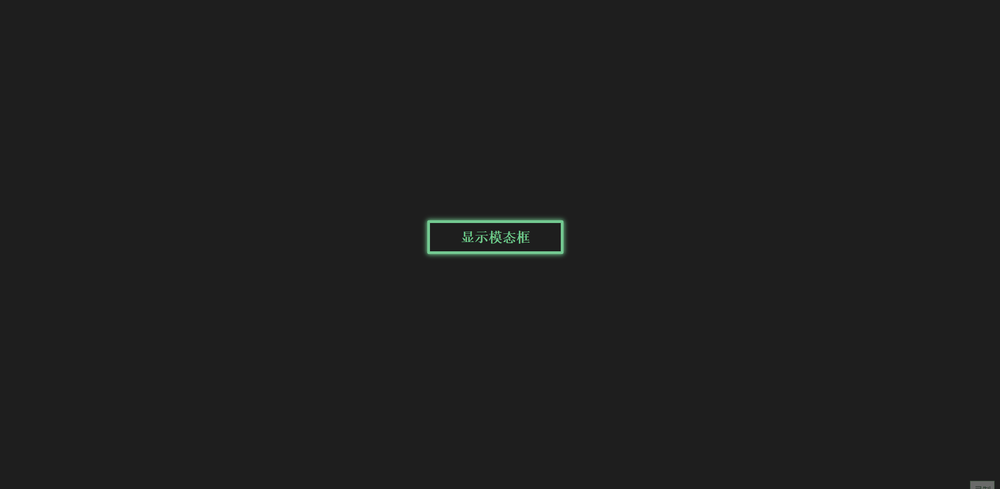
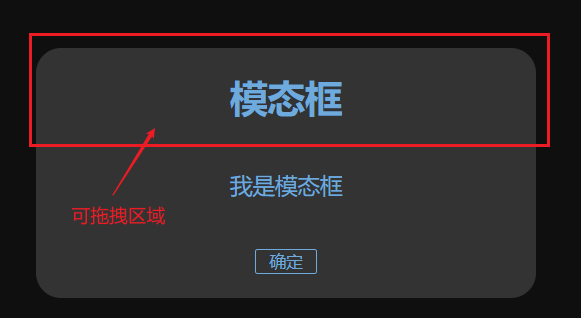
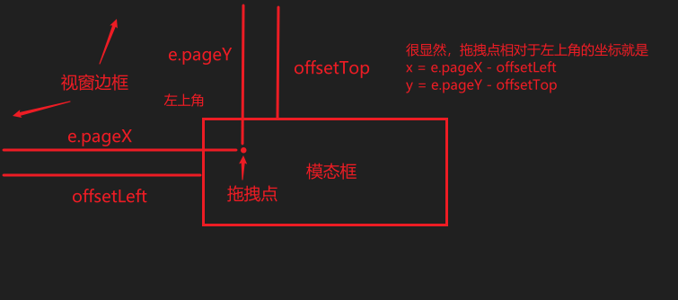
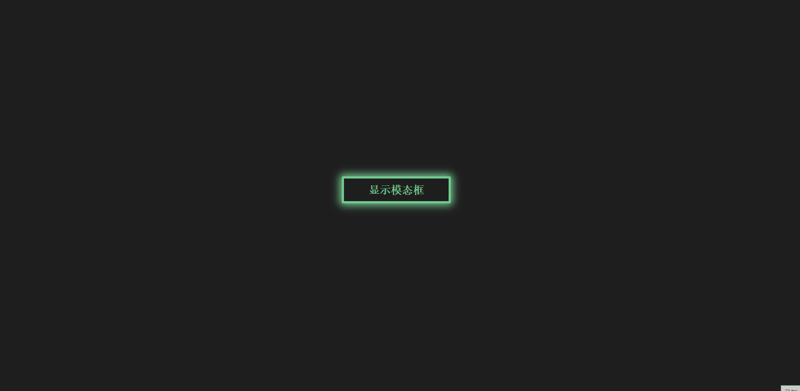
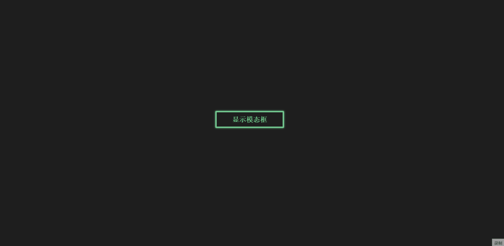

# 模态框

> 模态对话框（Modal Dialogue Box，又叫做模式对话框），是指在用户想要对对话框以外的应用程序进行操作时，必须首先对该对话框进行响应
>
> 摘自百度百科

先放上效果图：



基本功能为点击窗口中间的发光按钮，使模态框出现，此时除了模态框部分，页面其他部分无法再点击（被遮罩覆盖），必须先点击确定对该模态框进行响应后才能进行其他操作。鼠标按住并拖动模态框标题块处，可以实现模态框的拖拽跟随效果。

## 实现

模态框效果的实现分为屏幕中间按钮和模态框确定按钮的点击事件的实现，以及模态框拖拽效果的实现。

由于两个按钮的点击事件只需要令模态框和一个模糊遮罩的显示或消失即可，实现比较简单，不做赘述，重点分析一下这个**拖拽效果怎么实现**。

拖拽效果**涉及到的鼠标事件有`mouseup`、`mousedown`和`mousemove`**，还需要通过**鼠标事件对象的`pageX`和`pageY`属性**和**元素的`offsetLeft`和`offsetTop`属性**来实时计算模态框的位置（**模态框为固定定位，通过`top`和`left`实现框体移动**），以此实现模态框的拖拽效果

### 可拖拽区域

首先要明确的是，**有效的拖拽区域应该设置为模态框的一部分区域**（这里设置为标题区域），这是因为网页的模态框往往有多个功能部分（如若干个输入框、按钮等），如果模态框整个部分都可以拖拽，那么就有可能影响功能区域交互效果。



### 拖拽点

所谓的拖拽点就是当鼠标在模态框可拖拽区域按下时的那个点。需要计算出这个点相对于模态框左上角的坐标，这个坐标将用于后续模态框随鼠标光标移动时边移量的计算。

当鼠标按下时，触发`mousedown`事件，利用鼠标事件对象的`pageX`和`pageY`属性标识出当前光标位置，再利用模态框的偏移量属性`offsetLeft`和`offsetTop`计算出拖拽点坐标，计算公式为：

```text
x = e.pageX - offsetLeft;
y = e.pageY - offsetTop;
```



### 模态框位置计算

当鼠标在模态框可拖拽区域按下并移动时，模态框要随着鼠标移动，这个移动是通过改变模态框的上边移量`top`和左边移量`left`实现的（模态框为固定定位）。`top`和`left`的值随鼠标坐标位置的改变而改变，利用上述求出的拖拽点相对于模态框左上角的坐标`(x, y)`以及相关推导关系，可以得出：

```text
left = e.pageX - x;
top = e.pageY - y;
```

### 事件监听器的设置

至此，就可以将上述计算关系应用到`mousedown`和`mousemove`事件中进行拖拽效果的实现了。

首先拖拽效果的触发，发生在鼠标在模态框可拖拽区域按下时，因此应该**给模态框可拖拽区域的元素添加`mousedown`监听器**（这里可拖拽区域元素为`modalTitle`）：

```js
modalTitle.onmousedown = function(e) {
    // 计算拖拽点位置
    let x = e.pageX - modalTitle.offsetLeft;
    let y = e.pageY - modalTitle.offsetTop;
    // ......
}
```

要明确的一点是，只有在**鼠标在模态框可拖拽区域按下时才需要鼠标移动事件`mousemove`发生**（鼠标移动触发时可以不停的更新`e.pageX`和`e.pageY`的值以便实时计算出模态框边移量），如果鼠标移动事件一直存在，那么有可能在鼠标压根没有点击拖拽时模态框就乱动了。所以`mousemove`应该在鼠标按下时绑定`mousemove`事件，在鼠标松开（`mouseuup`）时解绑`mousemove`事件：

```js
modalTitle.onmousedown = function(e) {
    // 计算拖拽点位置
    let x = e.pageX - modalTitle.offsetLeft;
    let y = e.pageY - modalTitle.offsetTop;
    // 鼠标按下时绑定 mousemove 事件
    targetElem.onmousemove = function(e) {
        modalCon.style.left = e.pageX - x;
        modalCon.style.top = e.pageY - y;
    }
}
modalTitle.onmouseup = function(e) {
    // 鼠标松开时解绑 mousemove 事件
    targetElem.onmousemove = ''
}
// 上述的 targetElem 是 mousemove 事件监听器应用的元素
```

**那么`mousemove`的监听器应该应用在哪个元素上呢？**既然是在模态框的可拖拽区域按下鼠标的，那就应用到模态框的可拖拽区域？但是如果应用到模态框的可拖拽区域（`modalTitle`）会导致一种结果就是：**当鼠标移动太快，鼠标光标有可能会脱离模态框，导致失败的拖拽效果**


那么应该应用在哪里？可以看到，鼠标是在整个文档的可视范围内移动的，那么**`mousemove`监听器直接应用到`document`即可**

```js
modalTitle.addEventListener('mousedown', (e) => {
    let x = e.pageX - modalCon.offsetLeft;
    let y = e.pageY - modalCon.offsetTop;
    document.onmousemove = (e) => {
        modalCon.style.left = e.pageX - x + 'px';
        modalCon.style.top = e.pageY - y + 'px';
    }
})
modalTitle.addEventListener('mouseup', (e) => {
    document.onmousemove = '';
})
```



至此整个拖拽效果就完成了！！！

## 演示链接

[代码的CodePen演示链接](https://codepen.io/Zhao-Bocheng/pen/RwVNPwz)

文章源码：<https://gitee.com/thisismyaddress/bocheng-blogs/tree/master/%E7%BD%91%E9%A1%B5%E7%89%B9%E6%95%88/%E6%A8%A1%E6%80%81%E6%A1%86>
