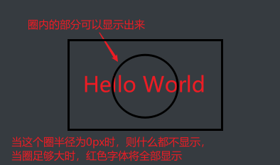
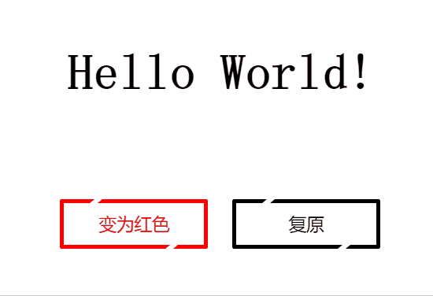

# 简单的HelloWorld变色

这个网页特效的基本功能就是点击左侧按钮会变色，点击右侧按钮恢复颜色

在这个简单功能的基础上添加一些特效，用以练习CSS。添加的特效有：

- 鼠标悬浮在按钮上时按钮边框会出现移动的效果  
  按钮特效的实现需要借助按钮的**两个伪元素`::before`和`::after`**，以及**伪类`:hover`还有过渡样式`transition`**；  
  鼠标悬浮在按钮上时，边框上下的两个“空隙”会相互反向移动，实际上是两个和背景颜色一样颜色的**伪元素斜方块（`transform: skew(-50deg)`）在动**，这就产生了好像边框发生变化的效果

- 当颜色从原有颜色变为目标颜色时，圆圈遮罩从中间扩大到两侧；当颜色变回原有颜色时，圆圈遮罩从两侧缩回中间  
  这里的实现需要**借助`clip-path`和`transition`**；  
  实际上如下图的黑色字体的“Hello World!”的上面一层有一个绝对定位的红色“Hello World!”，只是最开始通过`clip-path: circle(0px)`产生一个显示部分为半径`0px`的圆形遮罩空间给隐藏了。当点击“变为红色”按钮后，这个圆形遮罩显示空间变为了半径`200px`，显示的空间足够大，红色的“Hello World!就会完全显示”。在过渡属性`transition`的作用下红色字体会慢慢地显示出来
  
  

## 效果

## 演示链接

[代码的CodePen演示链接](https://codepen.io/Zhao-Bocheng/pen/jOmOVgv)

文章源码：<https://gitee.com/thisismyaddress/bocheng-blogs/tree/master/%E7%BD%91%E9%A1%B5%E7%89%B9%E6%95%88/%E7%AE%80%E5%8D%95%E7%9A%84HelloWorld%E5%8F%98%E8%89%B2>
