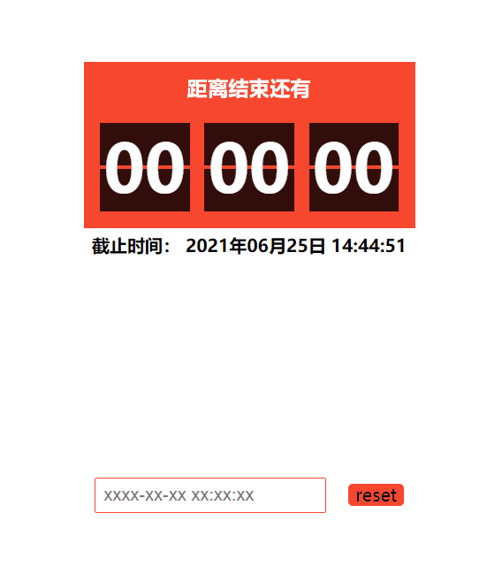
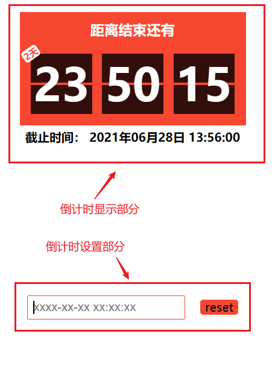

# 网页倒计时

制作一个简单的网页倒计时器。这个倒计时可以根据输入的截止时间进行倒计时，输入的截止日期数据会被缓存在本地存储（"deadlineDate"）（源码见文末）



这里使用原生JS进行相关网页逻辑的编写，主要应用到的API有

- `document.getElementById()`: 用于获取DOM元素节点，方便向节点填入数据并显示
- `Window.setInterval()`: 用于每隔一秒刷新一次显示的倒计时数据。这是实现这个倒计时功能的关键
- `elem.addEventListener()`: 用于绑定事件，这里只是用于绑定重置按钮的点击事件
- 内置对象`Date`: 用于获取一切和时间相关的值

整个网页应用分为两个主要部分：倒计时显示部分和倒计时设置部分



当进入该页面时，如果没有设置截止时间，则默认截止时间为进入页面的时间，倒计时显示部分不运行。需要根据输入框提示输入指定格式下的日期时间进行设置，方可使倒计时运行起来。但**这里我并没有对日期的输入进行容错处理，无法处理用户的错误输入**

倒计时显示部分的最大单位是“天”，当剩余时间小于1天时，这个单位是不会出现的

## 在编码过程中认识到的新内容

在对Date对象进行基本运算（除加法外，这时是字符串拼接，调用`toString()`）时Date对象会自动调用`valueOf()`转为整型的毫秒数

- Date对象实例是可以直接通过减法改变时间的，此时与Date对象相减的整数表示的是毫秒数
  比如：

  ```js
  let deadlineDate = new Date();
  console.log(deadlineDate); // 输出的是日期字符串
  deadlineDate -= 24 * 60 * 60 * 1000; // 此时日期减少了一天
  console.log(deadlineDate); // 输出的是毫秒数
  ```

  事实上还可以通过乘法、除法等运算改变值，也可以使用比较运算符直接比较时间（此时为毫秒数的比较），日期对象会自动调用`valueOf()`转化为毫秒值。加法除外，因为此时就变成了字符串拼接

  ```js
  let deadlineDate = new Date();
  console.log(deadlineDate + 24 * 60 * 60 * 1000); // 日期字符串和数值的拼接
  console.log(deadlineDate * 2); // 原有毫秒值的两倍
  ```

- Date对象实例是可以直接和Date对象实例相减的，也可以直接和毫秒数（整数）相减，此时表示的是两个毫秒数的减法
  比如：

  ```js
  let deadlineDate = new Date("2021-6-26 17:00:00");
  let deadlineMillis = +new Date();
  let curTime = new Date();
  console.log(deadlineDate - curTime); // 此时输出毫秒数的差值
  console.log(deadlineMillis - curTime); // 此时输出毫秒数的差值
  ```

  实际上也可以是除加法外的其他基本运算，这里日期对象都自动转化成了毫秒数进行运算了

文章源码：<https://gitee.com/thisismyaddress/bocheng-blogs/tree/master/%E7%BD%91%E9%A1%B5%E7%89%B9%E6%95%88/%E7%BD%91%E9%A1%B5%E5%80%92%E8%AE%A1%E6%97%B6>
